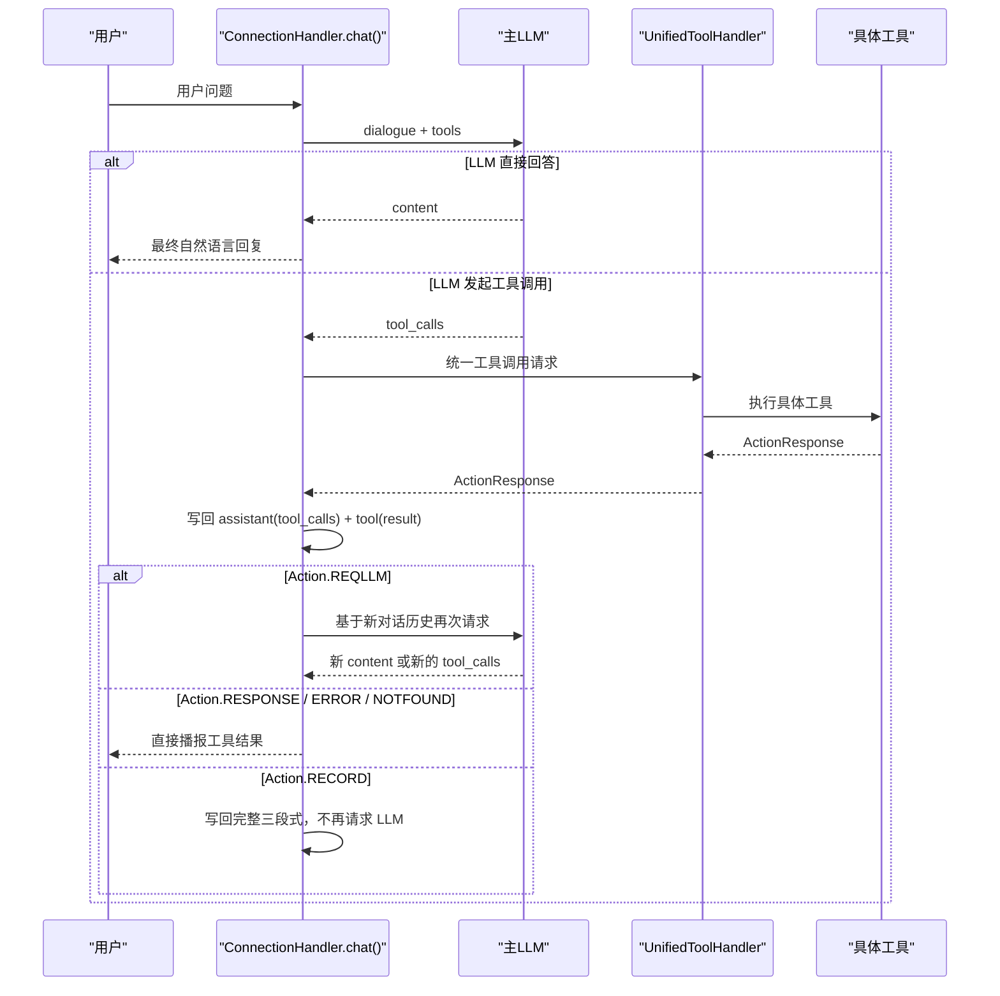

# Agent Loop 详细设计

## 1. 文档目标

本文档用于沉淀 `xiaozhi-esp32-server` 在 `function_call` 模式下的 Agent loop 实现。

这里的 Agent loop，不是一个额外独立进程，而是指主聊天 `LLM` 在一次用户请求内部形成的如下闭环：

1. 用户输入
2. 主 `LLM` 判断是否调用工具
3. 服务端执行工具
4. 把工具结果回填进对话历史
5. 再次请求主 `LLM`
6. 重复上述过程，直到得到最终自然语言答案或达到深度上限

这个闭环主要由以下模块协同完成：

- `core/connection.py`
- `core/providers/tools/unified_tool_handler.py`
- `core/utils/dialogue.py`
- `plugins_func/register.py`

## 2. 术语定义

本文中的关键术语定义如下：

- `Agent loop`
  - 指一次用户请求内部，“LLM -> tool -> LLM -> ... -> final answer”的递归闭环
- `主 LLM`
  - 指 `ConnectionHandler.chat()` 使用的聊天大模型
- `工具调用`
  - 指主 `LLM` 通过 `tool_calls` 或兼容文本协议发起的函数调用
- `工具回填`
  - 指把 `assistant(tool_calls)` 和 `tool(result)` 重新写回对话历史
- `最终回答`
  - 指不再继续调用工具，而是直接生成给用户看的自然语言结果

## 3. 设计目标

Agent loop 的设计目标是：

1. 允许主 `LLM` 逐步获取外部信息，而不是一次提示词内硬编码所有能力
2. 统一多类工具来源，避免上层逻辑感知插件、MCP、IoT 的差异
3. 让工具调用在对话历史中可追踪、可复用、可继续推理
4. 支持单轮多工具调用
5. 在异常、超时、中断场景下保持闭环可恢复或可终止
6. 对无限递归做上限保护

## 4. 总体架构

从调用职责看，Agent loop 可以拆成四层：

1. Loop 编排层
   - `ConnectionHandler.chat()`
   - 负责构造 `dialogue`、请求 LLM、识别工具调用、控制递归深度

2. 工具路由层
   - `UnifiedToolHandler`
   - 负责把统一格式的工具调用分发到具体执行器

3. 工具执行层
   - `ToolManager`
   - `ServerPluginExecutor`
   - `ServerMCPExecutor`
   - `DeviceIoTExecutor`
   - `DeviceMCPExecutor`
   - `MCPEndpointExecutor`

4. 对话状态层
   - `Dialogue`
   - 负责把系统提示词、few-shot、用户消息、工具调用链、工具结果整合成下一轮 `LLM` 入参

## 5. 触发条件

Agent loop 只在以下条件下开启：

1. 当前 `intent_type == "function_call"`
2. 当前连接存在 `func_handler`
3. 当前没有触发强制终局回答

也就是说：

- `intent_llm` 模式不会进入本文描述的主 Agent loop
- `function_call` 模式才会把工具定义传入主 `LLM`

## 6. 顶层时序

单轮 Agent loop 的标准时序如下：



## 7. Loop 入口

Agent loop 的真实入口是 `ConnectionHandler.chat(query, depth=0)`。

一次顶层调用通常由：

- `startToChat()`
- `conn.executor.submit(conn.chat, actual_text)`

触发。

递归调用则由：

- `_handle_function_result(...)`
- `self.chat(None, depth=depth + 1)`

触发。

因此，这个 Agent loop 不是 while 循环，而是一个带深度参数的递归状态机。

## 8. 初始输入构造

### 8.1 顶层调用输入

顶层调用时，`chat(query, depth=0)` 会完成这些动作：

1. 生成新的 `sentence_id`
2. 把用户问题写入 `dialogue`
3. 给 `tts_text_queue` 写入 `SentenceType.FIRST`

此时，当前轮次的用户消息成为本轮 Agent loop 的起点。

### 8.2 递归调用输入

递归调用时，`query` 为 `None`，并不会新增一条用户消息。

此时新的 `LLM` 请求依赖的输入来自已经补入 `dialogue` 的：

- `assistant(tool_calls)`
- `tool(result)`

也就是说，递归轮次本质上是让模型继续消费“刚才工具做了什么、结果是什么”。

## 9. 深度控制与终止保护

### 9.1 最大深度

当前实现对 Agent loop 设置了固定深度上限：

```python
MAX_DEPTH = 5
```

当 `depth >= MAX_DEPTH` 时：

1. 设置 `force_final_answer = True`
2. 不再把 `functions` 传给主 `LLM`
3. 向对话历史补一条系统性质的用户消息：

```text
[系统提示] 已达到最大工具调用次数限制，请你基于目前已经获取的所有信息，直接给出最终答案。不要再尝试调用任何工具。
```

### 9.2 设计意图

这个限制的目标是：

1. 防止模型在工具与工具之间来回循环
2. 防止 provider 兼容异常导致死循环
3. 即使工具链不完整，也要求模型基于已有上下文收敛出最终回答

### 9.3 强制终局的实际效果

达到最大深度后，主 `LLM` 的下一次调用入参中不再包含 `functions`，因此：

- 模型即使想再调用工具，也没有工具可调用
- 闭环会被强制收敛到自然语言答案

## 10. LLM 入参构造

### 10.1 输入组成

Agent loop 每一轮请求主 `LLM` 时，都由以下两部分组成：

1. `llm_dialogue`
2. `functions`

其中：

- `llm_dialogue` 来自 `Dialogue.get_llm_dialogue_with_memory(...)`
- `functions` 来自 `self.func_handler.get_functions()`

### 10.2 `llm_dialogue` 的组成层次

`llm_dialogue` 按逻辑分为四段：

1. 静态 `system` 提示词
2. 动态上下文 `system` 提示词
   - 时间
   - 记忆
   - 说话人信息
3. few-shot 临时消息
4. 真实对话历史

这意味着，每一轮 Agent loop 都不是从零开始，而是会持续携带之前的工具调用轨迹。

### 10.3 工具调用历史的补全修复

在把对话历史送给 `LLM` 前，`Dialogue._ensure_tool_calls_complete(...)` 会检查：

- 是否存在 `assistant(tool_calls)` 但缺少对应 `tool` 结果的悬空调用

如果存在，会自动补一条虚拟 `tool` 消息：

```json
{
  "role": "tool",
  "content": "{\"status\": \"interrupted\", \"message\": \"动作已取消/被打断\"}",
  "tool_call_id": "missing_id"
}
```

这样做的目的有两个：

1. 保持对话历史符合主流 LLM tool calling 协议
2. 防止上一轮被打断后，下一轮请求因缺少 `tool` 响应而报 400

### 10.4 `functions` 的组成

`functions` 是一组 OpenAI 风格工具定义，来源于统一工具层聚合。

每个工具描述至少包含：

- `type`
- `function.name`
- `function.description`
- `function.parameters`

在 Agent loop 中，主 `LLM` 并不知道工具来自哪里，它只看到统一后的工具 schema。

## 11. 第一阶段：主 LLM 决策

### 11.1 调用方式

在 `function_call` 模式下，主聊天调用方式如下：

```python
self.llm.response_with_functions(
    self.session_id,
    llm_dialogue,
    functions=functions,
)
```

它是一个流式接口。

### 11.2 流式输出的两类信号

每个流式 chunk 可能带来两类信息：

1. `content`
   - 普通自然语言文本
2. `tool_calls`
   - 工具调用增量

部分 provider 还可能通过文本协议返回工具调用，例如：

- `<tool_call>` 前缀
- 一段可解析的 JSON

服务端会兼容这两类协议。

### 11.3 流式处理中的状态变量

Agent loop 在一轮主 `LLM` 响应中会维护以下关键状态：

- `tool_call_flag`
  - 本轮是否已检测到工具调用
- `tool_calls_list`
  - 已聚合的工具调用列表
- `content_arguments`
  - 为兼容文本协议而积累的原始文本
- `response_message`
  - 正常自然语言回复缓存

### 11.4 工具调用的增量聚合

如果 provider 返回结构化 `tool_calls`，服务端会通过 `_merge_tool_calls(...)` 合并增量片段。

聚合后的统一结构为：

```json
[
  {
    "id": "call_xxx",
    "name": "get_weather",
    "arguments": "{\"city\":\"上海\"}"
  }
]
```

如果 provider 未返回结构化 `tool_calls`，但 `content_arguments` 中包含可提取 JSON，则在流式结束后再做一次解析。

### 11.5 工具调用前的过程文本抑制

一旦判定本轮存在工具调用：

1. 已累积的过程性自然语言会被清空
2. 不会直接播报给用户

设计原因是：

- 避免把内部工具名、知识库名或推理半成品播报出去
- 避免用户同时听到“我正在查天气”和最终天气结果，造成冗余

## 12. 第二阶段：统一工具执行

### 12.1 执行入口

统一工具执行入口为：

- `UnifiedToolHandler.handle_llm_function_call(...)`

Agent loop 不直接调用插件函数，而是始终先经过统一工具处理器。

### 12.2 标准入参

单工具调用入参格式如下：

```json
{
  "name": "tool_name",
  "id": "call_xxx",
  "arguments": "{\"key\":\"value\"}"
}
```

### 12.3 预处理动作

统一工具处理器在真正执行工具前会做以下动作：

1. 若 `arguments` 为字符串，则尝试 `json.loads(...)`
2. 根据工具 schema 自动补语言参数
   - `language`
   - `lang`
   - `locale`
3. 给设备发送“处理中”的通用显示消息

### 12.4 工具路由

最终执行通过 `ToolManager.execute_tool(...)` 完成。

工具可能被路由到：

- 服务端插件
- 服务端 MCP
- 设备 IoT
- 设备端 MCP
- MCP 接入点

上层 Agent loop 不关心具体来源。

### 12.5 超时控制

Agent loop 在等待工具执行结果时使用统一超时：

- `tool_call_timeout`
- 默认 `30s`

如果超时或抛异常，则统一转成：

- `Action.ERROR`

并继续进入后续结果处理，而不是让整个 loop 卡死。

## 13. 第三阶段：工具结果解释

### 13.1 统一返回模型

所有工具执行结果都被表达为 `ActionResponse`，主要动作类型包括：

1. `RESPONSE`
2. `REQLLM`
3. `RECORD`
4. `ERROR`
5. `NOTFOUND`

### 13.2 `RESPONSE`

表示工具结果已经是可直接给用户的自然语言。

后处理方式：

1. 清理不适合播报的内部内容
2. 做回复语言约束
3. 直接进入 TTS
4. 在 `dialogue` 中补一条 `assistant` 消息

此时 Agent loop 在这一分支上结束，不再递归请求主 `LLM`。

### 13.3 `ERROR` / `NOTFOUND`

这两类动作和 `RESPONSE` 类似：

- 直接把错误或未找到信息回给用户
- 不再继续请求主 `LLM`

### 13.4 `RECORD`

表示工具调用链需要写入历史，但不需要再次请求主 `LLM`。

后处理时会补齐完整三段式：

1. `assistant(tool_calls)`
2. `tool(result)`
3. `assistant(response)`

设计目的：

- 让模型从历史中学习到标准工具调用模式
- 保证下一条消息仍然接在 `assistant` 后面，而不是直接接 `tool`

### 13.5 `REQLLM`

这是 Agent loop 递归发生的关键动作。

含义是：

- 工具本身只返回结构化事实或上下文
- 还需要主 `LLM` 再次把这些信息组织成自然语言

典型场景包括：

- 天气查询
- 新闻检索
- RAG 搜索
- Home Assistant 状态读取

## 14. 第四阶段：工具结果回填

### 14.1 为什么必须回填

如果工具执行完之后不把结果写回对话历史，那么主 `LLM` 并不知道：

- 刚才调用了哪个工具
- 调用了几次
- 每次工具的真实输出是什么

因此下一轮 `LLM` 既无法正确回答，也容易重复调用同一个工具。

### 14.2 回填格式

工具回填采用标准三段式结构。

第一段，记录模型“决定调用了什么工具”：

```json
{
  "role": "assistant",
  "tool_calls": [
    {
      "id": "call_xxx",
      "function": {
        "name": "get_weather",
        "arguments": "{\"city\":\"上海\"}"
      },
      "type": "function",
      "index": 0
    }
  ]
}
```

第二段，记录“工具实际返回了什么”：

```json
{
  "role": "tool",
  "tool_call_id": "call_xxx",
  "content": "天气查询结果"
}
```

第三段，仅在 `RECORD` 场景补一条自然语言总结：

```json
{
  "role": "assistant",
  "content": "根据工具结果形成的自然语言"
}
```

### 14.3 `REQLLM` 场景的特殊处理

对于 `REQLLM`，工具结果在写回前还会经过：

- `wrap_tool_result_for_llm(tool_name, result.result)`

其目标是：

1. 把工具输出包装成适合 LLM 理解的上下文
2. 尽量减少模型机械复述内部工具名

## 15. 第五阶段：递归再问主 LLM

### 15.1 递归入口

当存在 `need_llm_tools` 时，系统执行：

```python
self.chat(None, depth=depth + 1)
```

这就是 Agent loop 的下一轮。

### 15.2 为什么递归时 `query=None`

因为下一轮不需要再添加新的用户问题。

新的输入语义已经体现在对话历史里：

- 前一轮模型决定调用的工具
- 工具执行结果

主 `LLM` 只需要继续消费这些新增上下文。

### 15.3 下一轮 LLM 的目标

递归后的下一轮主 `LLM` 可能做三件事：

1. 直接基于工具结果生成最终回答
2. 认为还需要继续调用更多工具
3. 在达到深度上限时，被迫基于现有结果收敛回答

因此 Agent loop 的本质不是单次函数调用，而是“多轮工具增强推理”。

## 16. 多工具调用

### 16.1 同轮多工具

如果主 `LLM` 在一轮里返回多个工具调用：

- 服务端会把它们都收集到 `tool_calls_list`
- 然后逐个等待结果

### 16.2 多工具的结果合并

统一工具处理器支持 `function_calls` 数组格式，并通过 `_combine_responses(...)` 做合并。

合并策略如下：

1. 只要有任何一个结果是 `Action.ERROR`，优先返回错误
2. 否则把多个结果的 `content` / `response` 拼接
3. 如果任一工具返回 `Action.REQLLM`，最终动作提升为 `REQLLM`

这意味着：

- 多工具场景可以继续进入下一轮主 `LLM`
- 由主 `LLM` 统一消费多个工具结果并整合回答

## 17. 中断与异常处理

### 17.1 用户打断

如果连接在流式阶段被设置为 `client_abort=True`：

- 当前流式迭代会立刻跳出

但历史中可能已经存在未闭合的 `assistant(tool_calls)`。

因此下一轮真正再请求主 `LLM` 前，需要依赖：

- `_ensure_tool_calls_complete(...)`

补全虚拟 `tool` 消息，防止协议不完整。

### 17.2 工具超时

工具超时不会让整个 Agent loop 崩溃，而是：

1. 转成统一错误结果
2. 上报工具异常
3. 继续交给 `_handle_function_result(...)`

因此用户通常仍然能收到一个可理解的失败答复。

### 17.3 参数解析错误

如果工具参数 JSON 解析失败，统一工具层会直接返回：

- `Action.ERROR`
- `response="无法解析函数参数"`

Agent loop 仍然按普通错误分支处理。

### 17.4 LLM 流错误

若主 `LLM` 流式处理异常：

1. 服务端会向 `tts_text_queue` 写入系统错误文本
2. 顶层调用时补一个 `SentenceType.LAST`
3. 终止本轮 Agent loop

## 18. TTS 与 Agent loop 的关系

Agent loop 与 TTS 是并行耦合关系，不是严格串行关系。

### 18.1 无工具调用时

- 主 `LLM` 的文本 chunk 可以边生成边进入 `tts_text_queue`

### 18.2 有工具调用时

- 工具调用前的过程性文本会被抑制
- 真正播报的通常是：
  - 工具直接返回的自然语言
  - 或递归后主 `LLM` 生成的最终答案

### 18.3 递归轮次与 `sentence_id`

递归调用时会复用当前 `sentence_id`，因此：

- 一次用户请求内部的多轮 Agent loop 回复，会被组织在同一轮播报上下文中

## 19. 与 `intent_llm` 的边界

`intent_llm` 也可能调用工具，但它不属于本文的主 Agent loop。

原因是：

1. `intent_llm` 是前置分流
2. 它的工具执行后处理主要发生在 `intentHandler.py`
3. 它不会走 `chat(None, depth + 1)` 这条主循环递归链

因此本文只讨论：

- `function_call` 模式下主聊天 `LLM` 驱动的工具增强闭环

## 20. 关键设计总结

当前项目中的 Agent loop，可以用一句话概括：

**主 `LLM` 负责决策下一步要不要调用工具，统一工具层负责执行，`dialogue` 负责保存工具轨迹，递归 `chat()` 负责推动整个闭环不断前进，直到收敛到最终答案。**

它的几个关键工程特征是：

1. 不是显式 while 循环，而是递归状态机
2. 工具调用轨迹会被标准化写回历史
3. 多轮工具增强依赖 `REQLLM`
4. 最大深度保护保证最终可收敛
5. 中断补全机制保证协议完整性

## 21. 后续可改进点

从当前实现看，后续还可以继续增强：

1. 把 `MAX_DEPTH` 改成可配置项
2. 把不同工具类别的重试策略拆开
3. 给 `REQLLM` 场景增加更细的 token / 时延观测
4. 对多工具并发执行增加更明确的顺序依赖语义
5. 为 Agent loop 增加统一 trace id，便于跨轮排障
