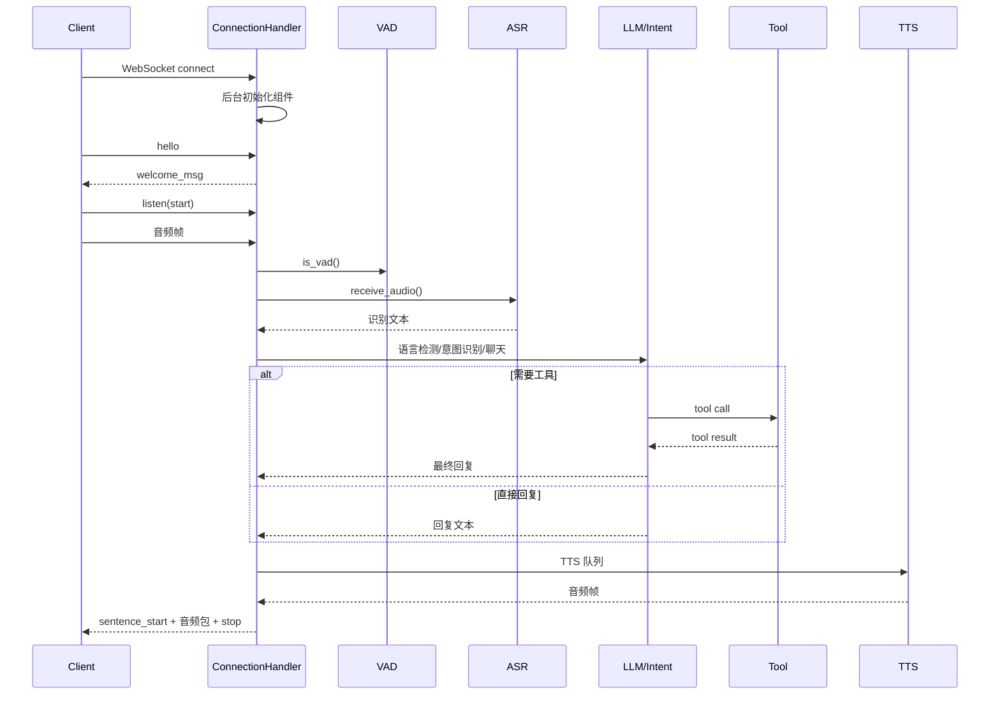
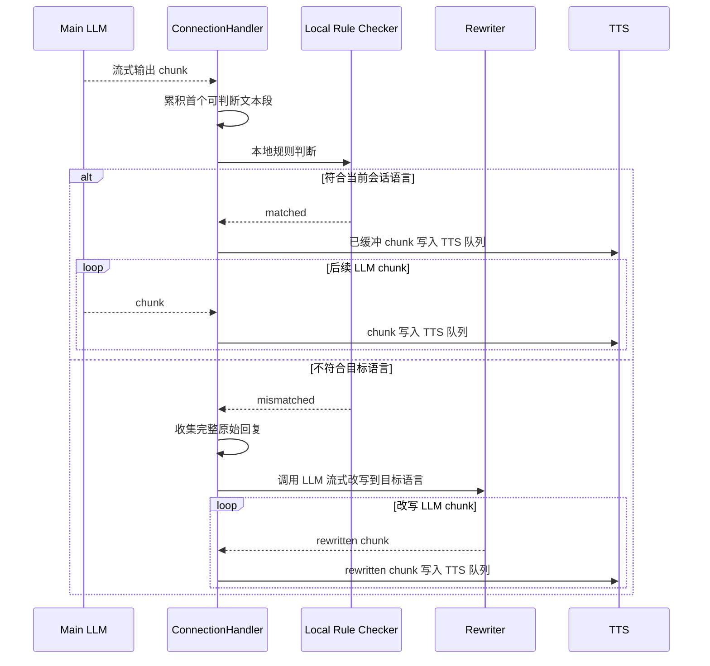

# 完整问答工作流详细设计

## 1. 目标

本文档描述当前项目中一次完整问答从连接建立到语音播报结束的真实实现，覆盖以下内容：

- WebSocket 连接建立与后台初始化
- 文本消息与音频消息的统一入口
- `listen` 控制消息与音频采集流程
- `VAD`、`ASR`、语言检测、意图识别、`LLM` 的串联关系
- 工具调用与 `MCP` 执行链路
- `TTS` 切句、合成、流控和下发流程
- 打断、超时、绑定、输出限制等关键分支
- 关键日志与排障观察点

本文档优先描述当前代码中的真实行为，而不是理想化架构。

## 2. 设计范围

本次设计覆盖以下模块：

- `main/xiaozhi-server/core/connection.py`
- `main/xiaozhi-server/core/handle/*`
- `main/xiaozhi-server/core/providers/asr/*`
- `main/xiaozhi-server/core/providers/tts/*`
- `main/xiaozhi-server/core/providers/tools/*`
- `main/xiaozhi-server/core/utils/prompt_manager.py`
- `main/xiaozhi-server/core/utils/language_detector.py`
- `main/xiaozhi-server/plugins_func/*`

本次设计不包含以下内容：

- ESP32 固件侧音频采集实现细节
- 管理端页面操作流程
- 第三方上游模型内部实现
- 数据库表结构和运营配置流程

## 3. 参与角色与核心对象

一次问答涉及以下参与方：

1. 客户端设备
   - 负责建立 WebSocket 连接
   - 上送 `hello`、`listen`、`abort`、`mcp` 等文本消息
   - 上送音频二进制帧
   - 接收字幕控制消息和音频包
2. `ConnectionHandler`
   - 每条连接的核心上下文
   - 负责消息路由、组件初始化、对话编排、工具执行和资源清理
3. `VAD`
   - 判断当前音频帧是否包含人声
4. `ASR`
   - 接收音频并在合适时机产出识别文本
5. `Intent/LLM`
   - 负责意图判断、对话生成、工具决策、语言分类
6. `ToolHandler`
   - 统一封装服务端插件、设备端 MCP、MCP 接入点、IOT 等工具能力
7. `TTS`
   - 负责文本切句、音频合成、编码、流控和发送

连接级关键状态主要保存在 `ConnectionHandler` 中：

- `session_id`
- `sentence_id`
- `client_abort`
- `client_is_speaking`
- `client_listen_mode`
- `current_language`
- `current_speaker`
- `vad`
- `asr`
- `tts`
- `llm`
- `intent`
- `memory`
- `func_handler`

## 4. 总体流程概览

完整问答主链路如下：

1. 客户端建立 WebSocket 连接
2. 服务端创建 `ConnectionHandler`
3. 服务端启动后台初始化
4. 客户端发送 `hello`
5. 客户端发送 `listen start`
6. 客户端持续发送音频帧
7. `VAD` 判断是否有人声
8. `ASR` 接收音频并在结束时返回文本
9. 服务端做语言检测、意图判断
10. 进入普通聊天或工具调用链路
11. 生成回复文本
12. `TTS` 切句并调用语音服务
13. 服务端把字幕控制消息和音频包发给客户端
14. 本轮播报结束，等待下一轮输入

可以用下图概括：

## 5. 连接建立与初始化流程

### 5.1 连接建立

入口位于 `ConnectionHandler.handle_connection()`。

建立连接后会立即完成以下动作：

1. 获取事件循环并保存到 `self.loop`
2. 解析请求头和客户端 IP
3. 记录 `device-id`
4. 判断当前连接是否来自 `mqtt_gateway`
5. 初始化活动时间戳
6. 启动超时检查任务 `_check_timeout()`
7. 准备 `welcome_msg`
8. 从配置中读取默认输出采样率
9. 通过 `asyncio.create_task(self._background_initialize())` 启动后台初始化

设计要点：

- 主连接循环不会等待初始化完成
- 初始化是异步后台进行的
- 因此客户端过早发送音频时，可能出现 `VAD/ASR` 未就绪

### 5.2 后台初始化

后台初始化入口是 `_background_initialize()`，包含两段：

1. `_initialize_private_config_async()`
2. `self.executor.submit(self._initialize_components)`

其中 `_initialize_private_config_async()` 负责：

- 从接口获取设备差异化配置
- 根据私有配置更新 `VAD/ASR/TTS/LLM/Memory/Intent`
- 更新 `prompt`、`voiceprint`、`mcp_endpoint`、`context_providers`
- 按需调用 `initialize_modules(...)` 创建新模块实例
- 将新实例挂到当前连接：
  - `self.tts`
  - `self.vad`
  - `self.asr`
  - `self.llm`
  - `self.intent`
  - `self.memory`

### 5.3 组件初始化

`_initialize_components()` 继续完成运行期初始化：

1. 初始化 `TTS` 实例
2. 调 `self.tts.open_audio_channels(self)` 启动 TTS 线程
3. 如设备未绑定则结束初始化
4. 切换连接级 logger
5. 快速构建系统提示词
6. 为当前连接挂载 `VAD` 和 `ASR`
7. 调 `self.asr.open_audio_channels(self)` 打开语音识别通道
8. 初始化声纹识别
9. 初始化记忆模块
10. 初始化意图识别模块
11. 初始化工具系统
12. 初始化上报线程
13. 增强系统提示词
14. 注入工具调用 few-shot 示例

### 5.4 初始化完成的判定

当前代码中有两个层面的“完成”：

1. 弱完成
   - `self.vad is not None`
   - `self.asr is not None`
   - 这是音频入口处 `vad_ready/asr_ready` 的判定标准
2. 强完成
   - `ASR/TTS` 实例已挂载
   - `open_audio_channels()` 已启动对应线程或连接
   - 工具系统和提示词增强已完成

当前实现没有单独的统一 `fully_ready` 标志位。

## 6. 文本消息入口设计

### 6.1 文本消息总入口

文本消息入口是 `handleTextMessage()`，内部通过 `TextMessageProcessor` 做 JSON 解析和处理器分发。

当前支持的消息类型有：

- `hello`
- `abort`
- `listen`
- `iot`
- `mcp`
- `server`
- `ping`

### 6.2 hello 消息

`hello` 主要做能力协商和欢迎包返回。

处理内容包括：

1. 记录客户端音频格式
2. 记录客户端特性
3. 如果客户端支持 `mcp`：
   - 创建 `MCPClient`
   - 发送 MCP 初始化消息
4. 把 `welcome_msg` 发回客户端

### 6.3 listen 消息

`listen` 是录音状态控制消息，分为三种状态：

1. `start`
   - 清空当前音频状态和缓冲区
   - 为下一轮录音做准备
2. `stop`
   - 标记当前轮语音输入结束
   - 流式 ASR 会发送 stop 请求
   - 非流式 ASR 会直接触发识别
3. `detect`
   - 表示客户端已经给出了文字检测结果
   - 可用于唤醒词处理或端侧文本直达问答

### 6.4 abort 消息

`abort` 用于打断当前播报和后续生成。

处理行为：

1. 设置 `client_abort = True`
2. 清空队列
3. 给客户端发送 `{"type":"tts","state":"stop"}`
4. 清除服务端讲话状态

### 6.5 mcp 消息

`mcp` 消息由客户端回传，用于：

- MCP 初始化响应
- 工具列表响应
- 工具调用结果响应

服务端收到后异步交给 `handle_mcp_message(...)` 继续处理。

## 7. 音频消息入口设计

### 7.1 二进制音频入口

`ConnectionHandler._route_message()` 在收到 `bytes` 消息后，会先做以下判断：

1. `VAD/ASR` 是否已挂载
2. 是否来自 `mqtt_gateway`
3. 是否需要解析 16 字节头部

如果 `vad` 或 `asr` 还没准备好，会直接丢帧，并打印：

- `收到音频帧但VAD/ASR未就绪，丢弃`

### 7.2 MQTT 网关音频

对于来自 `mqtt_gateway` 的数据包，会解析头部字段：

- payload length
- sequence
- timestamp
- opus length

之后把真实音频数据送入 `asr_audio_queue`。

### 7.3 普通音频队列

普通 WebSocket 二进制帧会直接进入 `asr_audio_queue`，后续再由音频处理线程消费。

## 8. VAD 与 ASR 处理流程

### 8.1 音频处理入口

音频处理主入口是 `handleAudioMessage(conn, audio)`。

处理步骤：

1. 调 `conn.vad.is_vad(conn, audio)` 判断是否有人声
2. 如果设备刚被唤醒，则短时间忽略 VAD
3. 执行长时间无声检查
4. 调 `conn.asr.receive_audio(conn, audio, have_voice)` 进入识别模块

### 8.2 流式和非流式 ASR

ASR 处理模型分两类：

1. 流式 ASR
   - 在录音过程中持续收包
   - `listen stop` 时发送结束信号
2. 非流式 ASR
   - 先缓存本轮音频
   - `listen stop` 后统一识别

无论哪种方式，最终目标都是得到一段文本并进入 `startToChat()`。

### 8.3 ASR 输出

识别成功后通常会有以下关键日志：

- `发起上游ASR请求`
- `上游ASR响应成功`
- `识别文本: ...`

这是问答流程真正开始进入语言层的分界点。

## 9. startToChat 编排流程

`startToChat()` 是从识别文本进入对话系统的统一入口。

处理步骤如下：

1. 解析是否包含说话人 JSON 信息
2. 保存 `current_speaker`
3. 检查设备是否待绑定
4. 检查设备输出字数限制
5. 如果当前正在播报且不是 `manual` 模式，则先打断
6. 用主 `LLM` 做语言检测
7. 更新 `current_language`
8. 按当前语言刷新系统提示词
9. 先进行意图处理
10. 若意图未命中，发送 STT 文本给客户端
11. 在线程池中启动 `conn.chat(actual_text)`

这里的设计目标是：

- 让语言检测发生在真正聊天前
- 让意图识别优先于普通聊天
- 让用户可以在播报中插话

## 10. 意图识别与预处理分支

### 10.1 优先级

`handle_user_intent()` 的优先级如下：

1. 退出命令
2. 唤醒词处理
3. `function_call` 模式下跳过传统意图识别
4. 非 `function_call` 模式下走 `intent.detect_intent(...)`

### 10.2 退出命令

如果命中退出命令：

- 给客户端发送 STT 文本
- 直接关闭连接

### 10.3 唤醒词回复

如果命中唤醒词且启用了缓存音频回复：

1. 先等待 `tts` 初始化完成
2. 生成新的 `sentence_id`
3. 发送唤醒词缓存音频
4. 将回复补入对话历史
5. 后台异步刷新缓存音频

### 10.4 传统意图识别

传统意图识别可能返回 `function_call` 结构。

结果处理分支包括：

- `continue_chat`
  - 返回 `False`，继续走普通聊天
- `result_for_context`
  - 基于上下文生成结果并直接播报
- 其他函数调用
  - 直接调用统一工具系统
  - 再根据工具返回的 `Action` 决定是否继续 LLM

## 11. 普通聊天主流程

### 11.1 chat 入口

普通聊天主流程位于 `ConnectionHandler.chat()`。

顶层调用时会先做：

1. 生成新的 `sentence_id`
2. 将用户消息写入 `dialogue`
3. 往 `tts_text_queue` 投递一个 `SentenceType.FIRST`

### 11.2 记忆注入

在调用大模型前，如果启用了 `memory` 且当前有用户查询，会先执行：

- `self.memory.query_memory(query)`

返回的记忆片段会被拼进最终的 `llm_dialogue`。

### 11.3 LLM 调用

按当前模式分两类：

1. `function_call` 模式
   - 给 LLM 同时传入对话和工具描述
   - 允许模型直接产出工具调用
2. 普通模式
   - 只传入对话
   - 直接产出回复文本

### 11.4 流式输出消费

服务端会逐 chunk 处理 LLM 输出：

1. 收集普通文本内容
2. 首次检测情绪内容并异步提取表情
3. 如果检测到工具调用，则切换到工具执行分支
4. 如果没有工具调用，则进入回复流式播报判定
5. 服务端先缓冲首个可判断文本段，用本地规则判断是否符合当前会话语言
6. 如果符合，则后续 LLM chunk 持续写入 TTS 队列，由 TTS 线程按标点切句合成
7. 如果不符合，则收集完整原始回复，再调用 LLM 流式改写成目标语言，并把改写后的流式 chunk 写入 TTS 队列

补充说明：

- 当前主聊天回复的正常路径已经恢复为“LLM 边流式生成，TTS 边消费文本”
- 首段语言不符合当前会话语言时，才会进入“完整收集后流式改写”的兜底路径
- 这样做是为了在首包延迟和语言一致性之间取得平衡
- 工具调用链路仍然保留原有的工具执行与结果回填机制

### 11.5 回复语言流式判定链路

这里需要特别区分两类“语言检测”：

1. 输入语言检测
   - 发生在 `startToChat()` 中
   - 触发时机是 `ASR` 文本刚出来、进入主聊天前
   - 目标是更新 `current_language`
2. 回复语言流式判定
   - 发生在 `chat()` 中
   - 触发时机是主 `LLM` 输出首个可判断文本段时
   - 目标是决定本轮是否可以直接流式写入 `TTS` 队列

回复语言流式判定入口由以下方法协作完成：

- `_decide_reply_stream_language(...)`
- `_enqueue_tts_text_chunk(...)`
- `_stream_rewrite_response_to_target_language(...)`

主流程如下：

1. `chat()` 逐 chunk 消费主 `LLM` 的流式输出
2. 对自然语言内容先写入 `response_message`，用于最终对话历史
3. 同时缓冲 `reply_pending_chunks`
4. 调 `_decide_reply_stream_language(...)` 做本地规则判断
5. 如果判断为 `matched`，立即把已缓冲 chunk 写入 `tts_text_queue`，后续 chunk 也持续写入
6. 如果判断为 `mismatched`，不写入原文，继续收集完整回复
7. 主 `LLM` 结束后，调用 `_stream_rewrite_response_to_target_language(...)` 流式改写，改写 chunk 持续写入 `tts_text_queue`

这意味着：

- 正常语言匹配路径下，`TTS` 不再等待主 `LLM` 完整输出
- 只有语言不匹配的兜底路径，才会先等待主 `LLM` 完整输出

#### 11.5.1 正常路径

当首个可判断文本段符合当前会话语言时：

1. 首段规则检测返回 `matched`
2. 已缓冲文本立即写入 `tts_text_queue`
3. 后续主 `LLM` chunk 继续直接写入 `tts_text_queue`
4. TTS 文本线程继续按标点切句并调用上游 TTS

#### 11.5.2 兜底路径

当首个可判断文本段明显不符合当前会话语言时：

1. 首段规则检测返回 `mismatched`
2. 原始主 `LLM` 输出只进入 `response_message`，不进入 TTS
3. 等主 `LLM` 完整结束后，拼接完整原文
4. 调 `_stream_rewrite_response_to_target_language(...)`
5. 改写 `LLM` 的流式 chunk 持续写入 `tts_text_queue`
6. 最终对话历史记录改写后的目标语言文本

可以用下图表示完整链路：

#### 11.5.3 日志识别

正常路径通常会看到：

- `回复首段语言规则检测通过，开始流式写入TTS`
- 随后较早出现 `发起上游TTS请求`

兜底路径通常会看到：

- `回复首段语言规则检测不匹配，等待完整回复后流式校正`
- `回复语言流式校正完成`

## 12. 工具调用工作流

### 12.1 工具调用判定

在 `function_call` 模式下，LLM 输出可能包含：

- OpenAI 风格 `tool_calls`
- 文本形式的 `<tool_call>` 或 JSON 调用结构

服务端会统一整理成 `tool_calls_list`。

### 12.2 工具执行入口

执行入口是：

- `self.func_handler.handle_llm_function_call(...)`

统一工具层会屏蔽具体来源差异，可能执行：

- 服务端插件
- 服务端 MCP
- 设备 IOT
- 设备端 MCP
- MCP 接入点工具

### 12.3 工具结果动作模型

工具执行结果统一用 `ActionResponse` 表达，当前支持：

1. `RESPONSE`
   - 工具返回内容可直接说给用户听
2. `REQLLM`
   - 工具结果先作为内部上下文，再请求 LLM 组织自然语言
3. `RECORD`
   - 将完整工具链写入对话历史，不再额外请求 LLM
4. `ERROR`
   - 直接报错
5. `NOTFOUND`
   - 直接返回未找到信息

### 12.4 设备端 MCP 链路

如果工具来自设备端 MCP，则执行链路为：

1. LLM 输出工具调用
2. 服务端把工具调用转成 `mcp` 文本消息发给客户端
3. 客户端执行本地能力
4. 客户端通过 `mcp` 消息回传结果
5. 服务端恢复等待中的 Future
6. 根据结果继续走 `RESPONSE` 或 `REQLLM`

### 12.5 工具结果去工具名处理

为了避免播报时出现内部工具名，服务端会先做：

- `sanitize_tool_response_for_speech(...)`

为了避免喂给 LLM 的结果被直接复读工具名，服务端会做：

- `wrap_tool_result_for_llm(...)`

## 13. TTS 编排与下发流程

### 13.1 TTS 输入队列

所有待播报文本最终都进入：

- `tts_text_queue`

TTS 文本线程 `tts_text_priority_thread()` 负责消费这些消息。

### 13.2 文本切句

当前默认 TTS 基类按标点切句：

- 首句使用更激进的切分标点
  - 包含 `，`、`、`、`~`
- 后续句子使用正常结束标点
  - `。！？；：`

这也是短前缀如“好啦”会被单独播报的原因。

### 13.3 合成模式

当前常见模式是：

1. 文本分段
2. 每段调用 `to_tts_stream()` 或 `to_tts()`
3. 调上游语音服务得到整段音频
4. 转成 Opus 包
5. 放入 `tts_audio_queue`

### 13.4 音频发送线程

`_audio_play_priority_thread()` 从 `tts_audio_queue` 取出音频后，会调用：

- `sendAudioMessage(...)`

它负责：

1. 发送 `sentence_start`
2. 发送音频包
3. 发送 `stop`
4. 必要时关闭连接

### 13.5 发送流控

为了减少卡顿，发送层引入了 `AudioRateController`：

- 前 `PRE_BUFFER_COUNT` 个包直接发送
- 后续可使用固定延迟或动态流控
- 支持普通 WebSocket 与 MQTT 网关两种下发方式

## 14. 关键异常与特殊分支

### 14.1 VAD/ASR 未就绪

现象：

- 连接刚建立时，客户端立刻发音频
- 服务端打印 `收到音频帧但VAD/ASR未就绪，丢弃`

影响：

- 会丢失连接早期的部分音频帧

### 14.2 播报中插话

当 `client_is_speaking=True` 且监听模式不是 `manual` 时：

- 新一轮用户输入会先触发 `abort`
- 然后再进入新的 `startToChat()`

### 14.3 设备未绑定

如果设备未绑定：

- 服务端会丢弃正常消息
- 定期播放绑定提示音和绑定码

### 14.4 长时间无语音

如果长时间没有检测到人声：

- 触发结束提示逻辑
- 或者直接关闭连接

### 14.5 输出超限

如果设备当天输出字符超过限制：

- 播放固定结束语
- 设置 `close_after_chat = True`
- 当前轮播报后关闭连接

## 15. 关键日志与排障观察点

建议按以下顺序观察日志：

1. 连接建立
   - `conn - Headers`
   - `WebSocket连接路径`
2. 初始化
   - `异步获取差异化配置成功`
   - `快速初始化组件: prompt成功`
   - `当前支持的函数列表`
3. 输入阶段
   - `收到hello消息`
   - `收到listen消息`
   - `收到音频帧但VAD/ASR未就绪`
4. 识别阶段
   - `发起上游ASR请求`
   - `上游ASR响应成功`
   - `识别文本`
5. 语言与对话阶段
   - `开始语言检测`
   - `语言检测结果`
   - `大模型收到用户消息`
6. 工具阶段
   - `执行工具`
   - `发送客户端mcp工具调用请求`
   - `客户端mcp工具调用 ... 成功`
7. 播报阶段
   - `发起上游TTS请求`
   - `上游TTS响应成功`
   - `发送第一段语音`
   - `发送音频消息`

### 15.1 日志与阶段对照

下面这些日志，分别代表问答链路中的具体阶段：

| 日志关键字 | 所属阶段 | 触发时机 | 说明 |
| --- | --- | --- | --- |
| `收到listen消息` | 录音控制阶段 | 客户端发送 `listen` 文本消息时 | 常见于 `state=start/stop/detect`，不是底层 WebSocket 刚建立连接时打印，而是建连后的业务控制消息 |
| `收到mcp消息` | MCP 协议阶段 | 客户端回传 `mcp` 文本消息时 | 可能是 MCP 初始化结果、工具列表、工具执行结果 |
| `收到音频帧但VAD/ASR未就绪，丢弃` | 初始化保护阶段 | 连接已建立，但 `vad/asr` 尚未挂载完成时收到音频帧 | 说明客户端发音频早于后台初始化完成 |
| `发起上游ASR请求` | 语音识别阶段 | 非流式 ASR 在 `listen stop` 后开始识别时 | 代表本轮音频已经结束，开始调用上游识别服务 |
| `上游ASR响应成功` | 语音识别阶段 | 上游 ASR 成功返回文本时 | 说明本轮音频已转成文字 |
| `识别文本:` | 语音转文本完成阶段 | ASR 文本已经回到服务端时 | 这是从音频链路切入语言链路的分界点 |
| `开始语言检测` | 语言判定阶段 | `startToChat()` 中，进入真正聊天前 | 用主 LLM 对本轮用户文本判定回复语言 |
| `语言检测成功` | 语言判定阶段 | 语言分类模型返回结果时 | 表示识别出了 `Chinese/English/...` |
| `切换会话语言` | 会话语言更新阶段 | 本轮文本触发语言切换时 | 例如 `Chinese -> English` |
| `语言识别结果:` | 语言判定收口阶段 | `current_language` 更新完成后 | 表示本轮最终采用的会话语言 |
| `构建增强提示词成功` | Prompt 刷新阶段 | 系统提示词按当前语言重建时 | 包含语言模板、时间、天气、上下文等增强信息 |
| `大模型收到用户消息:` | 主聊天阶段 | `ConnectionHandler.chat()` 开始时 | 表示本轮已经进入正式对话生成 |
| `OpenAI LLM完整输入参数` | LLM 调用阶段 | 每次调用 OpenAI 兼容大模型前 | 记录完整入参，包含 `messages/tools/model/stream` 等 |
| `OpenAI LLM完整原始输出chunk` | LLM 流式输出阶段 | 流式大模型每收到一个 chunk 时 | 这是原始流式块级日志，便于看 provider 原始返回 |
| `OpenAI LLM流式完整出参` | LLM 汇总阶段 | 一次流式调用结束后 | 新增日志，输出本次调用聚合后的完整文本，以及函数调用模式下的 `tool_calls` |
| `OpenAI LLM非流式完整出参` | LLM 汇总阶段 | 一次非流式调用结束后 | 新增日志，适用于语言检测、回复语言校正、传统意图识别等非流式调用 |
| `工具自动补充语言参数` | 工具预处理阶段 | 工具层准备执行前 | 根据当前会话语言为工具补齐 `language` 参数 |
| `执行工具:` | 工具执行阶段 | 服务端开始执行统一工具时 | 表示已从 LLM 回复切入工具链路 |
| `发送MCP接入点工具调用请求` | MCP 工具阶段 | 工具来自 MCP 接入点时 | 服务端正在向 MCP 接入点发起真实工具调用 |
| `MCP接入点工具调用 ... 成功` | MCP 工具阶段 | MCP 接入点返回结果时 | 工具结果已返回服务端，后续可能直接播报，也可能再进一轮 LLM |
| `回复首段语言规则检测通过，开始流式写入TTS` | 回复语言判定阶段 | 首个可判断文本段符合当前会话语言时 | 后续主 LLM chunk 会持续写入 TTS 队列 |
| `回复首段语言规则检测不匹配，等待完整回复后流式校正` | 回复语言判定阶段 | 首个可判断文本段明显不符合当前会话语言时 | 本轮会等待主 LLM 完整输出后再流式改写 |
| `回复语言流式校正完成` | 回复语言校正阶段 | 兜底改写 LLM 完成时 | 记录改写后的目标语言文本片段 |
| `发起上游TTS请求` | 语音合成阶段 | 文本已经定稿并准备调用上游 TTS 时 | 当前看到的 `text_preview` 就是最终待播报文案 |
| `上游TTS响应成功` | 语音合成阶段 | 上游 TTS 返回音频成功时 | 说明文本已成功转成音频数据 |
| `发送第一段语音` | 下发阶段 | 本轮第一段语音即将发给客户端时 | 常用于观察首包延迟和首句文案 |
| `发送音频消息` | 下发阶段 | 服务端向设备发送某段音频时 | 包含 `SentenceType.FIRST/MIDDLE/LAST` |

### 15.2 当前大模型日志策略

当前大模型日志分两层：

1. 原始块级日志
   - `OpenAI LLM完整原始输出chunk`
   - 用于定位 provider 的实时流式返回
2. 调用级汇总日志
   - `OpenAI LLM流式完整出参`
   - `OpenAI LLM非流式完整出参`
   - 用于直接查看一次调用最终产出的完整文本或工具调用

排障时建议优先看“调用级汇总日志”，只有当汇总结果不符合预期时，再回头看 chunk 级日志。

## 16. 当前实现的设计特点与限制

### 16.1 优点

- 音频、工具、LLM、TTS 各层职责相对清晰
- 工具系统兼容插件、设备 MCP、MCP 接入点等多种来源
- 工具结果和最终回复的日志阶段已经相对清晰，便于定位问题卡在哪一段
- 语言检测、记忆、提示词增强都在会话级动态生效

### 16.2 限制

- 初始化和首包音频接收并发进行，存在早期丢帧窗口
- 当前没有统一的 `fully_ready` 状态位
- 主聊天回复的正常路径已支持边生成边写入 TTS，但语言不匹配兜底路径仍需等待主 LLM 完整输出后再流式改写
- 首句逗号切分策略容易导致过短回复被拆成两次 TTS
- 一些日志语义不够精确，例如记忆分支复用了“使用主LLM作为意图识别模型”文案

## 17. 后续演进建议

建议后续优先考虑以下改进：

1. 为连接增加统一的 `ready_state`
   - 区分 `object_ready` 和 `channel_ready`
2. 在未就绪阶段缓存少量音频帧
   - 避免连接建立初期丢失首句
3. 为 TTS 首句切分增加最小长度阈值
   - 避免“好啦”这类短前缀单独合成
4. 统一初始化成功日志
   - 让排障时能明确知道哪一阶段完成
5. 对工具调用链路补充更严格的超时和熔断指标

## 18. 总结

当前项目的完整问答流程本质上是一个连接级状态机：

- 连接建立阶段负责准备上下文和依赖
- 输入阶段负责把文本或音频归一化到 `startToChat()`
- 理解阶段负责语言检测、意图判断、LLM 和工具调用
- 输出阶段负责 TTS 切句、音频流控和回传客户端

理解这条链路时，最关键的是把握三个事实：

1. 初始化是异步后台完成的
2. 用户输入会先经过意图层，再决定是否进入普通聊天
3. 工具结果不一定直接播报，可能还会再进入一轮 LLM 组织回复
