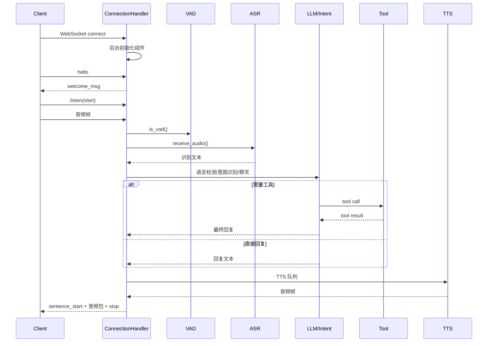
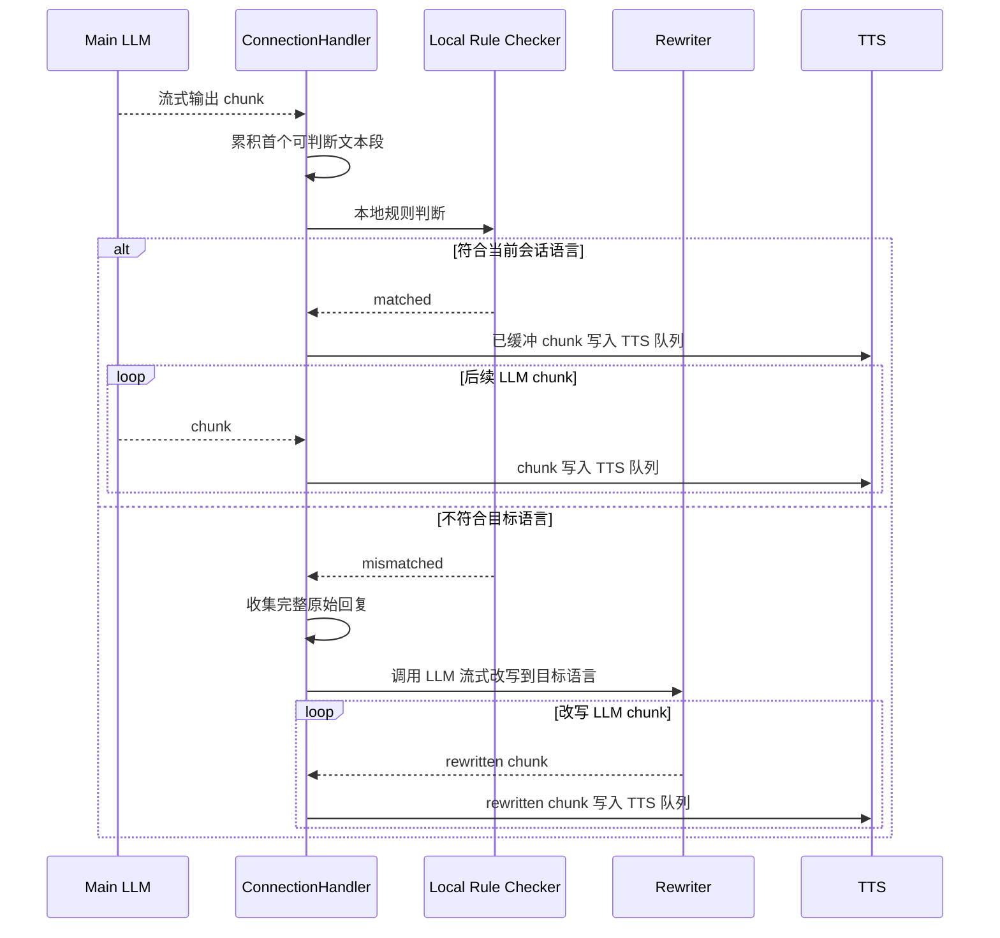
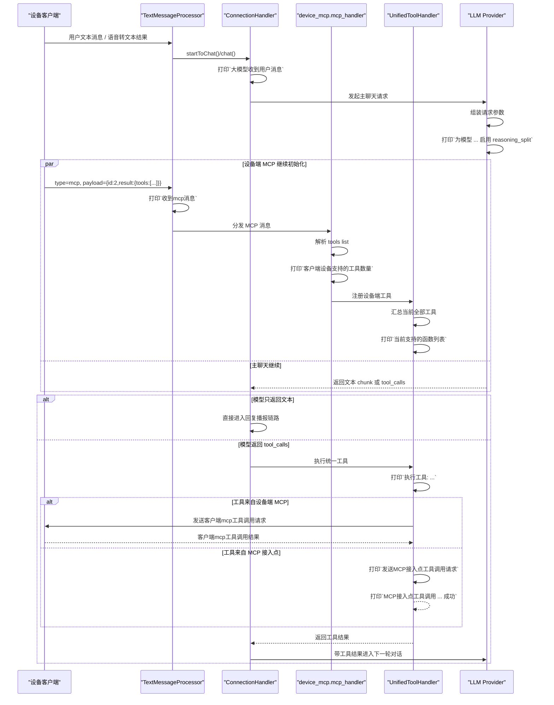

# 完整问答工作流详细设计

## 1. 目标

本文档描述当前项目中一次完整问答从连接建立到语音播报结束的真实实现，覆盖以下内容：

- WebSocket 连接建立与后台初始化
- 文本消息与音频消息的统一入口
- `listen` 控制消息与音频采集流程
- `VAD`、`ASR`、语言检测、意图识别、`LLM` 的串联关系
- 工具调用与 `MCP` 执行链路
- `TTS` 切句、合成、流控和下发流程
- 打断、超时、绑定、输出限制等关键分支
- 关键日志与排障观察点

本文档优先描述当前代码中的真实行为，而不是理想化架构。

## 2. 设计范围

本次设计覆盖以下模块：

- `main/xiaozhi-server/core/connection.py`
- `main/xiaozhi-server/core/handle/*`
- `main/xiaozhi-server/core/providers/asr/*`
- `main/xiaozhi-server/core/providers/tts/*`
- `main/xiaozhi-server/core/providers/tools/*`
- `main/xiaozhi-server/core/utils/prompt_manager.py`
- `main/xiaozhi-server/core/utils/language_detector.py`
- `main/xiaozhi-server/plugins_func/*`

本次设计不包含以下内容：

- ESP32 固件侧音频采集实现细节
- 管理端页面操作流程
- 第三方上游模型内部实现
- 数据库表结构和运营配置流程

## 3. 参与角色与核心对象

一次问答涉及以下参与方：

1. 客户端设备
   - 负责建立 WebSocket 连接
   - 上送 `hello`、`listen`、`abort`、`mcp` 等文本消息
   - 上送音频二进制帧
   - 接收字幕控制消息和音频包
2. `ConnectionHandler`
   - 每条连接的核心上下文
   - 负责消息路由、组件初始化、对话编排、工具执行和资源清理
3. `VAD`
   - 判断当前音频帧是否包含人声
4. `ASR`
   - 接收音频并在合适时机产出识别文本
5. `Intent/LLM`
   - 负责意图判断、对话生成、工具决策、语言分类
6. `ToolHandler`
   - 统一封装服务端插件、设备端 MCP、MCP 接入点、IOT 等工具能力
7. `TTS`
   - 负责文本切句、音频合成、编码、流控和发送

连接级关键状态主要保存在 `ConnectionHandler` 中：

- `session_id`
- `sentence_id`
- `client_abort`
- `client_is_speaking`
- `client_listen_mode`
- `current_language`
- `current_speaker`
- `vad`
- `asr`
- `tts`
- `llm`
- `intent`
- `memory`
- `func_handler`

## 4. 总体流程概览

完整问答主链路如下：

1. 客户端建立 WebSocket 连接
2. 服务端创建 `ConnectionHandler`
3. 服务端启动后台初始化
4. 客户端发送 `hello`
5. 客户端发送 `listen start`
6. 客户端持续发送音频帧
7. `VAD` 判断是否有人声
8. `ASR` 接收音频并在结束时返回文本
9. 服务端做语言检测、意图判断
10. 进入普通聊天或工具调用链路
11. 生成回复文本
12. `TTS` 切句并调用语音服务
13. 服务端把字幕控制消息和音频包发给客户端
14. 本轮播报结束，等待下一轮输入

可以用下图概括：



## 5. 连接建立与初始化流程

### 5.1 连接建立

入口位于 `ConnectionHandler.handle_connection()`。

建立连接后会立即完成以下动作：

1. 获取事件循环并保存到 `self.loop`
2. 解析请求头和客户端 IP
3. 记录 `device-id`
4. 判断当前连接是否来自 `mqtt_gateway`
5. 初始化活动时间戳
6. 启动超时检查任务 `_check_timeout()`
7. 准备 `welcome_msg`
8. 从配置中读取默认输出采样率
9. 通过 `asyncio.create_task(self._background_initialize())` 启动后台初始化

设计要点：

- 主连接循环不会等待初始化完成
- 初始化是异步后台进行的
- 因此客户端过早发送音频时，可能出现 `VAD/ASR` 未就绪

### 5.2 后台初始化

后台初始化入口是 `_background_initialize()`，包含两段：

1. `_initialize_private_config_async()`
2. `self.executor.submit(self._initialize_components)`

其中 `_initialize_private_config_async()` 负责：

- 从接口获取设备差异化配置
- 根据私有配置更新 `VAD/ASR/TTS/LLM/Memory/Intent`
- 更新 `prompt`、`voiceprint`、`mcp_endpoint`、`context_providers`
- 按需调用 `initialize_modules(...)` 创建新模块实例
- 将新实例挂到当前连接：
  - `self.tts`
  - `self.vad`
  - `self.asr`
  - `self.llm`
  - `self.intent`
  - `self.memory`

### 5.3 组件初始化

`_initialize_components()` 继续完成运行期初始化：

1. 初始化 `TTS` 实例
2. 调 `self.tts.open_audio_channels(self)` 启动 TTS 线程
3. 如设备未绑定则结束初始化
4. 切换连接级 logger
5. 快速构建系统提示词
6. 为当前连接挂载 `VAD` 和 `ASR`
7. 调 `self.asr.open_audio_channels(self)` 打开语音识别通道
8. 初始化声纹识别
9. 初始化记忆模块
10. 初始化意图识别模块
11. 初始化工具系统
12. 初始化上报线程
13. 增强系统提示词
14. 注入工具调用 few-shot 示例

### 5.4 初始化完成的判定

当前代码中有两个层面的“完成”：

1. 弱完成
   - `self.vad is not None`
   - `self.asr is not None`
   - 这是音频入口处 `vad_ready/asr_ready` 的判定标准
2. 强完成
   - `ASR/TTS` 实例已挂载
   - `open_audio_channels()` 已启动对应线程或连接
   - 工具系统和提示词增强已完成

当前实现没有单独的统一 `fully_ready` 标志位。

## 6. 文本消息入口设计

### 6.1 文本消息总入口

文本消息入口是 `handleTextMessage()`，内部通过 `TextMessageProcessor` 做 JSON 解析和处理器分发。

当前支持的消息类型有：

- `hello`
- `abort`
- `listen`
- `iot`
- `mcp`
- `server`
- `ping`

### 6.2 hello 消息

`hello` 主要做能力协商和欢迎包返回。

处理内容包括：

1. 记录客户端音频格式
2. 记录客户端特性
3. 如果客户端支持 `mcp`：
   - 创建 `MCPClient`
   - 发送 MCP 初始化消息
4. 把 `welcome_msg` 发回客户端

### 6.3 listen 消息

`listen` 是录音状态控制消息，分为三种状态：

1. `start`
   - 清空当前音频状态和缓冲区
   - 为下一轮录音做准备
2. `stop`
   - 标记当前轮语音输入结束
   - 流式 ASR 会发送 stop 请求
   - 非流式 ASR 会直接触发识别
3. `detect`
   - 表示客户端已经给出了文字检测结果
   - 可用于唤醒词处理或端侧文本直达问答

### 6.4 abort 消息

`abort` 用于打断当前播报和后续生成。

处理行为：

1. 设置 `client_abort = True`
2. 清空队列
3. 给客户端发送 `{"type":"tts","state":"stop"}`
4. 清除服务端讲话状态

### 6.5 mcp 消息

`mcp` 消息由客户端回传，用于：

- MCP 初始化响应
- 工具列表响应
- 工具调用结果响应

服务端收到后异步交给 `handle_mcp_message(...)` 继续处理。

## 7. 音频消息入口设计

### 7.1 二进制音频入口

`ConnectionHandler._route_message()` 在收到 `bytes` 消息后，会先做以下判断：

1. `VAD/ASR` 是否已挂载
2. 是否来自 `mqtt_gateway`
3. 是否需要解析 16 字节头部

如果 `vad` 或 `asr` 还没准备好，会直接丢帧，并打印：

- `收到音频帧但VAD/ASR未就绪，丢弃`

### 7.2 MQTT 网关音频

对于来自 `mqtt_gateway` 的数据包，会解析头部字段：

- payload length
- sequence
- timestamp
- opus length

之后把真实音频数据送入 `asr_audio_queue`。

### 7.3 普通音频队列

普通 WebSocket 二进制帧会直接进入 `asr_audio_queue`，后续再由音频处理线程消费。

## 8. VAD 与 ASR 处理流程

### 8.1 音频处理入口

音频处理主入口是 `handleAudioMessage(conn, audio)`。

处理步骤：

1. 调 `conn.vad.is_vad(conn, audio)` 判断是否有人声
2. 如果设备刚被唤醒，则短时间忽略 VAD
3. 执行长时间无声检查
4. 调 `conn.asr.receive_audio(conn, audio, have_voice)` 进入识别模块

### 8.2 流式和非流式 ASR

ASR 处理模型分两类：

1. 流式 ASR
   - 在录音过程中持续收包
   - `listen stop` 时发送结束信号
2. 非流式 ASR
   - 先缓存本轮音频
   - `listen stop` 后统一识别

无论哪种方式，最终目标都是得到一段文本并进入 `startToChat()`。

### 8.3 ASR 输出

识别成功后通常会有以下关键日志：

- `发起上游ASR请求`
- `上游ASR响应成功`
- `识别文本: ...`

这是问答流程真正开始进入语言层的分界点。

## 9. startToChat 编排流程

`startToChat()` 是从识别文本进入对话系统的统一入口。

处理步骤如下：

1. 解析是否包含说话人 JSON 信息
2. 保存 `current_speaker`
3. 检查设备是否待绑定
4. 检查设备输出字数限制
5. 如果当前正在播报且不是 `manual` 模式，则先打断
6. 用主 `LLM` 做语言检测
7. 更新 `current_language`
8. 按当前语言刷新系统提示词
9. 先进行意图处理
10. 若意图未命中，发送 STT 文本给客户端
11. 在线程池中启动 `conn.chat(actual_text)`

这里的设计目标是：

- 让语言检测发生在真正聊天前
- 让意图识别优先于普通聊天
- 让用户可以在播报中插话

## 10. 意图识别与预处理分支

### 10.1 优先级

`handle_user_intent()` 的优先级如下：

1. 退出命令
2. 唤醒词处理
3. `function_call` 模式下跳过传统意图识别
4. 非 `function_call` 模式下走 `intent.detect_intent(...)`

### 10.2 退出命令

如果命中退出命令：

- 给客户端发送 STT 文本
- 直接关闭连接

### 10.3 唤醒词回复

如果命中唤醒词且启用了缓存音频回复：

1. 先等待 `tts` 初始化完成
2. 生成新的 `sentence_id`
3. 发送唤醒词缓存音频
4. 将回复补入对话历史
5. 后台异步刷新缓存音频

### 10.4 `intent_llm` 前置意图识别模式

`intent_llm` 是一个“前置分流器”。

它的核心特点不是“是否使用大模型”，而是：

- 主聊天 `LLM` 开始正式回复前，会先额外调用一次“意图识别 `LLM`”
- 这次调用不负责自然语言回答，只负责判断“是否应该触发某个工具”
- 只有当前置意图识别返回 `continue_chat` 时，才会进入普通聊天主流程

换句话说，`intent_llm` 的执行顺序是：

1. 用户文本进入 `handle_user_intent()`
2. `handle_user_intent()` 调用 `conn.intent.detect_intent(...)`
3. `IntentProvider.detect_intent()` 组装提示词和工具列表
4. 通过 `self.llm.response_no_stream(system_prompt, user_prompt)` 发起一次非流式 `LLM` 请求
5. `LLM` 返回一个严格 JSON
6. 服务端解析 JSON，决定：
   - 继续普通聊天
   - 直接回答上下文问题
   - 直接执行工具

#### 10.4.1 调用入口

前置意图识别的入口在：

- `core/handle/intentHandler.py`
- `analyze_intent_with_llm()`
- `process_intent_result()`

其中：

- `analyze_intent_with_llm()` 负责真正调用 `conn.intent.detect_intent(...)`
- `process_intent_result()` 负责解释 `LLM` 返回结果并执行后续动作

#### 10.4.2 与意图识别 LLM 的入参格式

`intent_llm` 模式下，给大模型的入参不是完整聊天协议，而是一次“系统提示词 + 用户提示词”的轻量非流式调用。

入参由两部分组成：

1. `system_prompt`
2. `user_prompt`

其中：

- `system_prompt` 由 `get_intent_system_prompt(functions)` 动态生成
- `user_prompt` 由最近若干轮对话历史和本轮用户输入拼接而成

`system_prompt` 的结构由以下几部分组成：

1. 严格输出要求
   - 只能输出 JSON
   - 绝对不能输出自然语言
2. 角色说明
   - 你是一个意图识别助手
   - 负责分析用户最后一句话并选择函数
3. 特殊规则
   - 时间、日期、农历、城市等基础问题返回 `result_for_context`
   - 退出相关问句与真正退出命令区分开
4. 可用函数列表
   - 函数名
   - 描述
   - 参数结构
5. 返回格式要求
   - 必须包含 `function_call`
   - `function_call` 必须包含 `name`
   - 如需参数必须提供 `arguments`
6. 多指令补充说明
   - 单轮包含多个指令时允许返回 `function_calls`

当前代码中，提示词还会附加以下动态信息：

- `<musicNames>...</musicNames>`：本地音乐文件名列表
- Home Assistant 设备列表：当启用 `home_assistant` 配置时，追加设备清单

`user_prompt` 的实际格式如下：

```text
current dialogue:
user: ...
assistant: ...
user: 本轮用户输入
```

这里的历史窗口默认取最近 `4` 条对话。

#### 10.4.3 `intent_llm` 提示词的真实职责

这个提示词虽然也会把工具定义交给大模型，但它的职责与 `function_call` 模式不同：

- `intent_llm` 的模型职责是“做判断并返回 JSON 决策”
- 它不直接承担完整聊天回复生成
- 它不走主聊天流式输出链路
- 它本质上是在主聊天前增加了一次“命令分流”步骤

因此它和主聊天模型的关系是：

- `intent_llm`：判断是否需要工具
- 主聊天 `LLM`：真正自然语言回答

#### 10.4.4 `intent_llm` 期望出参格式

服务端期望 `intent_llm` 输出严格 JSON，典型格式如下：

```json
{"function_call": {"name": "continue_chat"}}
```

```json
{"function_call": {"name": "result_for_context"}}
```

```json
{"function_call": {"name": "get_weather", "arguments": {"city": "上海"}}}
```

```json
{"function_calls": [
  {"name": "light_on", "arguments": {"room": "bedroom"}},
  {"name": "volume_up", "arguments": {"value": 10}}
]}
```

当前实现最稳定、最核心的返回字段是：

- `function_call.name`
- `function_call.arguments`

如果解析失败，服务端会兜底视为：

```json
{"function_call": {"name": "continue_chat"}}
```

#### 10.4.5 服务端拿到 `intent_llm` 出参后的处理流程

`process_intent_result()` 会先对结果做 `json.loads(...)`，然后按以下分支处理：

1. `continue_chat`
   - 返回 `False`
   - 上层继续走普通聊天 `conn.chat(actual_text)`

2. `result_for_context`
   - 先发送 STT 文本给客户端
   - 将原始用户文本写入 `dialogue`
   - 读取当前时间、日期、星期、农历
   - 构造一个新的上下文提示词
   - 再调用 `conn.intent.replyResult(context_prompt, original_text)`
   - 生成自然语言答复并直接播报

3. 普通工具调用
   - 先把 `function_call.arguments` 规整成 JSON 字符串
   - 组装成统一结构：

```json
{
  "name": "tool_name",
  "id": "uuid",
  "arguments": "{\"key\":\"value\"}"
}
```

   - 给客户端发送 STT 文本
   - 上报工具调用
   - 在线程池中执行统一工具处理器

4. 工具执行后的动作分支
   - `Action.RESPONSE`
     - 直接播报工具返回的自然语言
   - `Action.REQLLM`
     - 先把工具结果包装成 `tool` 上下文
     - 写入 `dialogue`
     - 再调用 `conn.intent.replyResult(...)` 组织自然语言
   - `Action.ERROR` / `Action.NOTFOUND`
     - 直接播报错误或未找到信息

#### 10.4.6 `intent_llm` 模式的关键特征

从架构上看，`intent_llm` 模式有以下特点：

- 会额外增加一次非流式 `LLM` 调用
- 工具是否触发是在普通聊天之前就决定的
- 如果命中工具，主聊天链路可以完全不参与
- 更适合作为“命令识别前置层”
- 延迟通常高于 `function_call` 模式

## 11. 普通聊天主流程

### 11.1 chat 入口

普通聊天主流程位于 `ConnectionHandler.chat()`。

顶层调用时会先做：

1. 生成新的 `sentence_id`
2. 将用户消息写入 `dialogue`
3. 往 `tts_text_queue` 投递一个 `SentenceType.FIRST`

### 11.2 记忆注入

在调用大模型前，如果启用了 `memory` 且当前有用户查询，会先执行：

- `self.memory.query_memory(query)`

返回的记忆片段会被拼进最终的 `llm_dialogue`。

### 11.3 LLM 调用

按当前模式分两类：

1. `function_call` 模式
   - 给 LLM 同时传入对话和工具描述
   - 允许模型直接产出工具调用
2. 普通模式
   - 只传入对话
   - 直接产出回复文本

### 11.3.1 `function_call` 模式与主 LLM 的交互目标

`function_call` 模式下，没有独立的“前置意图识别请求”。

它的核心思路是：

- 直接把用户消息送入主聊天链路
- 由主 `LLM` 在生成回复的同时，自主决定：
  - 直接回答
  - 发起一个或多个工具调用

因此，`function_call` 模式不是“先判断、再聊天”，而是“聊天过程中顺带完成工具决策”。

### 11.3.2 `function_call` 模式的 LLM 入参格式

`function_call` 模式下，主聊天入口 `chat()` 会构造：

1. `dialogue`
2. `functions`

然后调用：

- `self.llm.response_with_functions(self.session_id, llm_dialogue, functions=functions)`

其中 `dialogue` 是一个标准消息列表，典型元素包括：

```json
{"role": "system", "content": "静态系统提示词"}
```

```json
{"role": "system", "content": "<context>动态上下文、记忆、说话人信息</context>"}
```

```json
{"role": "user", "content": "用户问题"}
```

```json
{
  "role": "assistant",
  "tool_calls": [
    {
      "id": "call_xxx",
      "function": {
        "name": "get_weather",
        "arguments": "{\"city\":\"上海\"}"
      },
      "type": "function",
      "index": 0
    }
  ]
}
```

```json
{
  "role": "tool",
  "tool_call_id": "call_xxx",
  "content": "工具执行结果"
}
```

`functions` 是当前可用工具的描述列表，来自：

- `self.func_handler.get_functions()`

其结构是 OpenAI 风格工具定义，典型形式如下：

```json
[
  {
    "type": "function",
    "function": {
      "name": "get_weather",
      "description": "查询天气",
      "parameters": {
        "type": "object",
        "properties": {
          "city": {
            "type": "string",
            "description": "城市名"
          }
        },
        "required": ["city"]
      }
    }
  }
]
```

此外，当前实现还会在 `function_call` 模式下注入一组 few-shot 临时消息，用于教会模型遵循标准工具调用三段式：

- `assistant(tool_calls)`
- `tool(result)`
- `assistant(response)`

这样做是为了让模型在第一轮就学习正确的工具使用模式，减少 provider 差异带来的调用退化。

### 11.3.3 `function_call` 模式下主 LLM 的提示词来源

`function_call` 模式并不会单独构造一份“意图识别专用提示词”。

它使用的是主会话系统提示词，外加：

- 当前语言约束
- 动态上下文
- 记忆内容
- 说话人信息
- 工具 few-shot 示例

也就是说：

- `intent_llm` 用的是“专门的意图识别提示词”
- `function_call` 用的是“完整聊天提示词 + 工具定义 + few-shot”

### 11.3.4 `function_call` 模式下主 LLM 的出参形态

`response_with_functions(...)` 是流式接口。

服务端消费时，期望每个 chunk 可能包含以下两类信息：

1. 自然语言文本 `content`
2. 工具调用增量 `tool_calls`

因此上层统一按如下语义消费：

- `(content, tools_call)`

在真实 provider 适配层中，可能出现以下几种形态：

1. 只有文本
   - `content != None`
   - `tools_call == None`

2. 只有工具调用
   - `content == None`
   - `tools_call != None`

3. 同一个 chunk 里既有文本又有工具调用
   - 服务端会同时累积文本和工具调用片段

4. 兼容性文本协议
   - 有些 provider 不直接返回结构化 `tool_calls`
   - 而是先输出 `<tool_call>` 前缀或 JSON 文本
   - 服务端会在流式末尾尝试把累积文本解析为工具调用结构

### 11.3.5 `function_call` 模式下服务端拿到出参后的流程

服务端在消费 `response_with_functions(...)` 的每个 chunk 时，会按以下顺序处理：

1. 累积自然语言文本到 `response_message`
2. 首次遇到文本时触发情绪识别
3. 如果发现 `tool_calls` 或 `<tool_call>` 信号，则置 `tool_call_flag = True`
4. 使用 `_merge_tool_calls(tool_calls_list, tools_call)` 合并增量工具调用
5. 如果最终存在工具调用，则抑制工具调用前的过程性自然语言，不直接播报

`tool_calls_list` 的统一结构为：

```json
[
  {
    "id": "call_xxx",
    "name": "get_weather",
    "arguments": "{\"city\":\"上海\"}"
  }
]
```

这个结构是后续统一工具处理器的标准输入。

### 11.4 流式输出消费

服务端会逐 chunk 处理 LLM 输出：

1. 收集普通文本内容
2. 首次检测情绪内容并异步提取表情
3. 如果检测到工具调用，则切换到工具执行分支
4. 如果没有工具调用，则进入回复流式播报判定
5. 服务端先缓冲首个可判断文本段，用本地规则判断是否符合当前会话语言
6. 如果符合，则后续 LLM chunk 持续写入 TTS 队列，由 TTS 线程按标点切句合成
7. 如果不符合，则收集完整原始回复，再调用 LLM 流式改写成目标语言，并把改写后的流式 chunk 写入 TTS 队列

补充说明：

- 当前主聊天回复的正常路径已经恢复为“LLM 边流式生成，TTS 边消费文本”
- 首段语言不符合当前会话语言时，才会进入“完整收集后流式改写”的兜底路径
- 这样做是为了在首包延迟和语言一致性之间取得平衡
- 工具调用链路仍然保留原有的工具执行与结果回填机制

### 11.4.1 大模型流式输出后的真实处理顺序

这里描述的是 `chat()` 在收到每个 LLM 流式 chunk 之后，当前代码真实会做的事情。

按顺序可以拆成以下几步：

1. 读取当前 `response`
   - 普通聊天模式下，`response` 直接就是文本 chunk
   - `function_call` 模式下，`response` 可能同时包含：
     - `content`
     - `tools_call`
2. 判断当前连接是否已被 `abort`
   - 如果 `client_abort = True`，直接跳出流式循环
3. 打印原始 chunk 日志
   - 用于后续排查 provider 原始返回是否异常
4. 解析工具调用信号
   - 如果当前是 `function_call` 模式
   - 会持续累积 `content_arguments`
   - 并根据 `tools_call` 或 `<tool_call>` 前缀设置 `tool_call_flag`
5. 做一次情绪提取触发
   - 只在本轮首次遇到非空文本时执行
   - 用于异步推断表情或情绪状态
6. 判断这段文本是否允许进入播报链路
   - 必须满足：
     - `content` 非空
     - `tool_call_flag == False`
7. 把文本写入 `response_message`
   - 无论最终是否立刻播报
   - 只要是自然语言文本，就先进入最终回复累积缓存
8. 根据 `reply_stream_state` 决定后续路径
   - `direct`
   - `pending`
   - `translate`

这意味着，LLM 每个 chunk 出来后，并不会直接无条件进入 TTS。

### 11.4.2 什么情况下 chunk 能直接进入 TTS 队列

当前代码中，一段 LLM 文本能否直接进入 `tts_text_queue`，必须同时满足以下条件：

1. 当前 chunk 有实际文本内容
2. 当前不是工具调用过程文本
3. `reply_stream_state == "direct"`

真正写入 TTS 队列的动作是：

- `_enqueue_tts_text_chunk(current_sentence_id, content)`

写入的是一个 `TTSMessageDTO`，其特点是：

- `sentence_type = MIDDLE`
- `content_type = TEXT`
- `content_detail = 当前可播报文本片段`

因此，`tts_text_queue` 存放的是“已通过聊天层筛选、允许进入播报链路的文本消息”，而不是简单等于“大模型所有原始 chunk”。

### 11.4.3 `reply_stream_state` 三态的含义

当前聊天流式播报存在三个状态：

1. `direct`
   - 当前 chunk 可以直接进入 TTS
2. `pending`
   - 先缓冲文本，等待回复语言规则判断
3. `translate`
   - 原始回复不直接播报，等待整段完成后再改写成目标语言

初始化规则是：

- 如果当前没有目标回复语言约束，默认 `direct`
- 如果当前要求回复语言是中文或英文，先 `pending`

这套逻辑不是仓库最早就有的，而是在后续“回复语言判定与流式播报链路”优化中新增的状态机。

### 11.4.4 `pending` 阶段具体会做什么

当 `reply_stream_state == "pending"` 时：

1. 当前 chunk 不会立刻进 `tts_text_queue`
2. 先写入 `reply_pending_chunks`
3. 把已缓冲文本拼成 `probe_text`
4. 调 `_inspect_reply_stream_language(probe_text, target_language)` 做本地规则判断

规则判断会返回三种结果：

1. `matched`
   - 说明当前首段文本符合目标语言
   - 立刻切换到 `direct`
   - 并把之前缓存的 `reply_pending_chunks` 全部补写进 `tts_text_queue`
2. `mismatched`
   - 说明当前首段文本明显不符合目标语言
   - 切换到 `translate`
   - 原始文本不直接播报
3. `unknown`
   - 说明当前信号还不够
   - 继续保持 `pending`

因此，`pending` 的本质是：

- 先攒首个可判断语言的文本片段
- 再决定后续回复到底走“直接播报”还是“改写后播报”

### 11.4.5 为什么有些 LLM chunk 不会进入 TTS 队列

以下几类 chunk 即使是模型正常输出，也可能不会直接进入 `tts_text_queue`：

1. 工具调用过程文本
   - 一旦识别为工具调用链路
   - 过程性文本会被抑制，避免播报内部工具名
2. `pending` 状态下尚未通过语言判定的文本
   - 会先进入 `reply_pending_chunks`
3. `translate` 状态下的原始文本
   - 最终播报的是改写后的目标语言文本
4. 空字符串或无效文本
   - 不会进入播报链路

所以，从实现角度看：

- 大模型 chunk
- 可播报文本消息
- 最终 TTS 请求

这三者不是一一对应关系。

### 11.4.6 一轮流式输出结束后会做什么

“这一轮文本结束了”的判断，不是依赖某个特殊 token，而是依赖：

- `for response in llm_responses:` 流式迭代自然结束

也就是说，只要：

- LLM 不再返回新的 chunk
- 或流式生成器完成

服务端就会进入收尾阶段。

收尾阶段主要做这些事：

1. 关闭流式响应对象（如果 provider 提供了 `close()`）
2. 处理工具调用
3. 拼接完整 `response_message`
4. 对 `pending` 状态做最终规则判断
5. 必要时进入 `translate` 路径，调用 `_stream_rewrite_response_to_target_language(...)`
6. 把最终文本写入对话历史
7. 在顶层调用时向 `tts_text_queue` 投递一个 `SentenceType.LAST`

这个 `LAST` 的含义是：

- 本轮文本输入已经结束
- 通知 TTS 线程做最后的收尾处理

### 11.4.7 `LAST` 发出后 TTS 线程会做什么

`LAST` 不是大模型发的，也不是 TTS provider 自己生成的，而是聊天主流程主动投递到 `tts_text_queue` 的结束标记。

默认 TTS 基类在收到 `LAST` 时，会执行：

- `_process_remaining_text_stream(...)`

它的作用是：

1. 从 `tts_text_buff` 中取出尚未被标点切分消费的尾部文本
2. 把这段残余文本强制送去合成
3. 防止最后半句因为没有等到新的标点而被吞掉

因此，一轮完整的“LLM 流式输出结束”并不只意味着：

- 不再有新的文本 chunk

还意味着：

- TTS 文本线程会收到一个明确的结束信号
- 并据此完成文本清尾、音频收口和播报结束

### 11.5 回复语言流式判定链路

这里需要特别区分两类“语言检测”：

1. 输入语言检测
   - 发生在 `startToChat()` 中
   - 触发时机是 `ASR` 文本刚出来、进入主聊天前
   - 目标是更新 `current_language`
2. 回复语言流式判定
   - 发生在 `chat()` 中
   - 触发时机是主 `LLM` 输出首个可判断文本段时
   - 目标是决定本轮是否可以直接流式写入 `TTS` 队列

回复语言流式判定入口由以下方法协作完成：

- `_decide_reply_stream_language(...)`
- `_enqueue_tts_text_chunk(...)`
- `_stream_rewrite_response_to_target_language(...)`

主流程如下：

1. `chat()` 逐 chunk 消费主 `LLM` 的流式输出
2. 对自然语言内容先写入 `response_message`，用于最终对话历史
3. 同时缓冲 `reply_pending_chunks`
4. 调 `_decide_reply_stream_language(...)` 做本地规则判断
5. 如果判断为 `matched`，立即把已缓冲 chunk 写入 `tts_text_queue`，后续 chunk 也持续写入
6. 如果判断为 `mismatched`，不写入原文，继续收集完整回复
7. 主 `LLM` 结束后，调用 `_stream_rewrite_response_to_target_language(...)` 流式改写，改写 chunk 持续写入 `tts_text_queue`

这意味着：

- 正常语言匹配路径下，`TTS` 不再等待主 `LLM` 完整输出
- 只有语言不匹配的兜底路径，才会先等待主 `LLM` 完整输出

#### 11.5.1 正常路径

当首个可判断文本段符合当前会话语言时：

1. 首段规则检测返回 `matched`
2. 已缓冲文本立即写入 `tts_text_queue`
3. 后续主 `LLM` chunk 继续直接写入 `tts_text_queue`
4. TTS 文本线程继续按标点切句并调用上游 TTS

#### 11.5.2 兜底路径

当首个可判断文本段明显不符合当前会话语言时：

1. 首段规则检测返回 `mismatched`
2. 原始主 `LLM` 输出只进入 `response_message`，不进入 TTS
3. 等主 `LLM` 完整结束后，拼接完整原文
4. 调 `_stream_rewrite_response_to_target_language(...)`
5. 改写 `LLM` 的流式 chunk 持续写入 `tts_text_queue`
6. 最终对话历史记录改写后的目标语言文本

可以用下图表示完整链路：



#### 11.5.3 日志识别

正常路径通常会看到：

- `回复首段语言规则检测通过，开始流式写入TTS`
- 随后较早出现 `发起上游TTS请求`

兜底路径通常会看到：

- `回复首段语言规则检测不匹配，等待完整回复后流式校正`
- `回复语言流式校正完成`

## 12. 工具调用工作流

### 12.1 工具调用判定

在 `function_call` 模式下，LLM 输出可能包含：

- OpenAI 风格 `tool_calls`
- 文本形式的 `<tool_call>` 或 JSON 调用结构

服务端会统一整理成 `tool_calls_list`。

补充说明：

- 如果 provider 直接返回结构化 `tool_calls`，则在流式过程中边收集边合并
- 如果 provider 只输出 `<tool_call>` 文本或完整 JSON 片段，服务端会在流式结束后再尝试解析
- 最终只要能规整成 `tool_calls_list`，后续执行链路就完全一致

### 12.2 工具执行入口

执行入口是：

- `self.func_handler.handle_llm_function_call(...)`

统一工具层会屏蔽具体来源差异，可能执行：

- 服务端插件
- 服务端 MCP
- 设备 IOT
- 设备端 MCP
- MCP 接入点工具

`handle_llm_function_call(...)` 收到的单工具标准入参如下：

```json
{
  "name": "tool_name",
  "id": "call_xxx",
  "arguments": "{\"key\":\"value\"}"
}
```

如果是多工具调用，则入参格式为：

```json
{
  "function_calls": [
    {
      "name": "tool_a",
      "arguments": {
        "key": "value"
      }
    },
    {
      "name": "tool_b",
      "arguments": {
        "key": "value"
      }
    }
  ]
}
```

统一工具层内部会继续做以下动作：

1. 若 `arguments` 是字符串，则先 `json.loads(...)`
2. 根据工具 schema 自动补 `language` / `lang` / `locale`
3. 给设备发送“处理中”显示消息
4. 通过 `ToolManager.execute_tool(...)` 路由到具体执行器

### 12.2.1 `function_call` 模式下拿到出参后的完整后处理

当 `chat()` 识别到最终存在工具调用后，后处理顺序如下：

1. 丢弃工具调用前已经流出的过程性自然语言
   - 避免把内部推理过程或工具名播报给用户

2. 遍历 `tool_calls_list`
   - 为每个工具调用上报开始事件
   - 调用 `self.func_handler.handle_llm_function_call(...)`
   - 等待超时结果，默认超时 `30s`

3. 收集工具执行结果
   - 成功则记录 `(ActionResponse, tool_call_data)`
   - 超时或异常则转成统一 `Action.ERROR`

4. 上报工具执行结果
   - 将工具输入和工具输出写入上报链路

5. 调用 `_handle_function_result(tool_results, depth, streamed_text)`
   - 按 `Action` 类型进入不同分支

### 12.2.2 `_handle_function_result(...)` 的动作分支

`_handle_function_result(...)` 是工具结果和后续对话状态衔接的关键节点。

它会把工具结果分成三类：

1. `RESPONSE` / `ERROR` / `NOTFOUND`
   - 直接把结果转成可播报文本
   - 写入 TTS
   - 同时补入 `dialogue` 的 `assistant` 消息

2. `RECORD`
   - 先写入一条 `assistant(tool_calls)` 消息
   - 再写入对应的 `tool` 消息
   - 最后补一条 `assistant(response)` 消息
   - 不再继续请求 LLM

3. `REQLLM`
   - 先写入一条 `assistant(tool_calls)` 消息
   - 再把工具结果包装成 `tool` 消息
   - 然后递归调用 `self.chat(None, depth=depth + 1)`
   - 让主 `LLM` 基于工具结果继续组织自然语言答案

这里的递归调用是 `function_call` 模式非常关键的一点：

- 第一轮 `LLM` 决定“要调用什么工具”
- 第二轮 `LLM` 才基于工具结果生成自然语言回答

因此 `function_call` 模式在复杂场景下，本质上可能形成：

1. 用户问题
2. 主 `LLM` 产出工具调用
3. 工具执行
4. 工具结果写回对话历史
5. 主 `LLM` 再次生成最终答案

### 12.2.3 对话历史中的工具调用回填格式

为了让第二轮 `LLM` 能理解“刚才已经调用过哪些工具、结果是什么”，服务端会把工具链回填进 `dialogue`。

回填格式如下：

`assistant(tool_calls)`：

```json
{
  "role": "assistant",
  "tool_calls": [
    {
      "id": "call_xxx",
      "function": {
        "name": "get_weather",
        "arguments": "{\"city\":\"上海\"}"
      },
      "type": "function",
      "index": 0
    }
  ]
}
```

`tool(result)`：

```json
{
  "role": "tool",
  "tool_call_id": "call_xxx",
  "content": "天气查询结果"
}
```

然后才会继续追加：

```json
{
  "role": "assistant",
  "content": "根据天气结果组织出的自然语言答复"
}
```

这种三段式结构有两个作用：

- 对 provider 保持标准兼容
- 让后续轮次的模型能够持续学习并复用正确的工具调用模式

### 12.3 工具结果动作模型

工具执行结果统一用 `ActionResponse` 表达，当前支持：

1. `RESPONSE`
   - 工具返回内容可直接说给用户听
2. `REQLLM`
   - 工具结果先作为内部上下文，再请求 LLM 组织自然语言
3. `RECORD`
   - 将完整工具链写入对话历史，不再额外请求 LLM
4. `ERROR`
   - 直接报错
5. `NOTFOUND`
   - 直接返回未找到信息

### 12.4 设备端 MCP 链路

如果工具来自设备端 MCP，则执行链路为：

1. LLM 输出工具调用
2. 服务端把工具调用转成 `mcp` 文本消息发给客户端
3. 客户端执行本地能力
4. 客户端通过 `mcp` 消息回传结果
5. 服务端恢复等待中的 Future
6. 根据结果继续走 `RESPONSE` 或 `REQLLM`

### 12.5 工具结果去工具名处理

为了避免播报时出现内部工具名，服务端会先做：

- `sanitize_tool_response_for_speech(...)`

为了避免喂给 LLM 的结果被直接复读工具名，服务端会做：

- `wrap_tool_result_for_llm(...)`

## 13. TTS 编排与下发流程

### 13.1 TTS 输入队列

所有待播报文本最终都进入：

- `tts_text_queue`

TTS 文本线程 `tts_text_priority_thread()` 负责消费这些消息。

### 13.2 文本切句

当前默认 TTS 基类按标点切句：

- 首句使用更激进的切分标点
  - 包含 `，`、`、`、`~`
- 后续句子使用正常结束标点
  - `。！？；：`

这也是短前缀如“好啦”会被单独播报的原因。

### 13.3 合成模式

当前常见模式是：

1. 文本分段
2. 每段调用 `to_tts_stream()` 或 `to_tts()`
3. 调上游语音服务得到整段音频
4. 转成 Opus 包
5. 放入 `tts_audio_queue`

### 13.4 音频发送线程

`_audio_play_priority_thread()` 从 `tts_audio_queue` 取出音频后，会调用：

- `sendAudioMessage(...)`

它负责：

1. 发送 `sentence_start`
2. 发送音频包
3. 发送 `stop`
4. 必要时关闭连接

### 13.5 发送流控

为了减少卡顿，发送层引入了 `AudioRateController`：

- 前 `PRE_BUFFER_COUNT` 个包直接发送
- 后续可使用固定延迟或动态流控
- 支持普通 WebSocket 与 MQTT 网关两种下发方式

## 14. 关键异常与特殊分支

### 14.1 VAD/ASR 未就绪

现象：

- 连接刚建立时，客户端立刻发音频
- 服务端打印 `收到音频帧但VAD/ASR未就绪，丢弃`

影响：

- 会丢失连接早期的部分音频帧

### 14.2 播报中插话

当 `client_is_speaking=True` 且监听模式不是 `manual` 时：

- 新一轮用户输入会先触发 `abort`
- 然后再进入新的 `startToChat()`

### 14.3 设备未绑定

如果设备未绑定：

- 服务端会丢弃正常消息
- 定期播放绑定提示音和绑定码

### 14.4 长时间无语音

如果长时间没有检测到人声：

- 触发结束提示逻辑
- 或者直接关闭连接

### 14.5 输出超限

如果设备当天输出字符超过限制：

- 播放固定结束语
- 设置 `close_after_chat = True`
- 当前轮播报后关闭连接

## 15. 关键日志与排障观察点

建议按以下顺序观察日志：

1. 连接建立
   - `conn - Headers`
   - `WebSocket连接路径`
2. 初始化
   - `异步获取差异化配置成功`
   - `快速初始化组件: prompt成功`
   - `当前支持的函数列表`
3. 输入阶段
   - `收到hello消息`
   - `收到listen消息`
   - `收到音频帧但VAD/ASR未就绪`
4. 识别阶段
   - `发起上游ASR请求`
   - `上游ASR响应成功`
   - `识别文本`
5. 语言与对话阶段
   - `开始语言检测`
   - `语言检测结果`
   - `大模型收到用户消息`
6. 工具阶段
   - `执行工具`
   - `发送客户端mcp工具调用请求`
   - `客户端mcp工具调用 ... 成功`
7. 播报阶段
   - `发起上游TTS请求`
   - `上游TTS响应成功`
   - `发送第一段语音`
   - `发送音频消息`

### 15.1 日志与阶段对照

下面这些日志，分别代表问答链路中的具体阶段：

| 日志关键字 | 所属阶段 | 触发时机 | 说明 |
| --- | --- | --- | --- |
| `收到listen消息` | 录音控制阶段 | 客户端发送 `listen` 文本消息时 | 常见于 `state=start/stop/detect`，不是底层 WebSocket 刚建立连接时打印，而是建连后的业务控制消息 |
| `收到mcp消息` | MCP 协议阶段 | 客户端回传 `mcp` 文本消息时 | 可能是 MCP 初始化结果、工具列表、工具执行结果 |
| `收到音频帧但VAD/ASR未就绪，丢弃` | 初始化保护阶段 | 连接已建立，但 `vad/asr` 尚未挂载完成时收到音频帧 | 说明客户端发音频早于后台初始化完成 |
| `发起上游ASR请求` | 语音识别阶段 | 非流式 ASR 在 `listen stop` 后开始识别时 | 代表本轮音频已经结束，开始调用上游识别服务 |
| `上游ASR响应成功` | 语音识别阶段 | 上游 ASR 成功返回文本时 | 说明本轮音频已转成文字 |
| `识别文本:` | 语音转文本完成阶段 | ASR 文本已经回到服务端时 | 这是从音频链路切入语言链路的分界点 |
| `开始语言检测` | 语言判定阶段 | `startToChat()` 中，进入真正聊天前 | 用主 LLM 对本轮用户文本判定回复语言 |
| `语言检测成功` | 语言判定阶段 | 语言分类模型返回结果时 | 表示识别出了 `Chinese/English/...` |
| `切换会话语言` | 会话语言更新阶段 | 本轮文本触发语言切换时 | 例如 `Chinese -> English` |
| `语言识别结果:` | 语言判定收口阶段 | `current_language` 更新完成后 | 表示本轮最终采用的会话语言 |
| `构建增强提示词成功` | Prompt 刷新阶段 | 系统提示词按当前语言重建时 | 包含语言模板、时间、天气、上下文等增强信息 |
| `大模型收到用户消息:` | 主聊天阶段 | `ConnectionHandler.chat()` 开始时 | 表示本轮已经进入正式对话生成 |
| `OpenAI LLM完整输入参数` | LLM 调用阶段 | 每次调用 OpenAI 兼容大模型前 | 记录完整入参，包含 `messages/tools/model/stream` 等 |
| `OpenAI LLM完整原始输出chunk` | LLM 流式输出阶段 | 流式大模型每收到一个 chunk 时 | 这是原始流式块级日志，便于看 provider 原始返回 |
| `OpenAI LLM流式完整出参` | LLM 汇总阶段 | 一次流式调用结束后 | 新增日志，输出本次调用聚合后的完整文本，以及函数调用模式下的 `tool_calls` |
| `OpenAI LLM非流式完整出参` | LLM 汇总阶段 | 一次非流式调用结束后 | 新增日志，适用于语言检测、回复语言校正、传统意图识别等非流式调用 |
| `工具自动补充语言参数` | 工具预处理阶段 | 工具层准备执行前 | 根据当前会话语言为工具补齐 `language` 参数 |
| `执行工具:` | 工具执行阶段 | 服务端开始执行统一工具时 | 表示已从 LLM 回复切入工具链路 |
| `发送MCP接入点工具调用请求` | MCP 工具阶段 | 工具来自 MCP 接入点时 | 服务端正在向 MCP 接入点发起真实工具调用 |
| `MCP接入点工具调用 ... 成功` | MCP 工具阶段 | MCP 接入点返回结果时 | 工具结果已返回服务端，后续可能直接播报，也可能再进一轮 LLM |
| `回复首段语言规则检测通过，开始流式写入TTS` | 回复语言判定阶段 | 首个可判断文本段符合当前会话语言时 | 后续主 LLM chunk 会持续写入 TTS 队列 |
| `回复首段语言规则检测不匹配，等待完整回复后流式校正` | 回复语言判定阶段 | 首个可判断文本段明显不符合当前会话语言时 | 本轮会等待主 LLM 完整输出后再流式改写 |
| `回复语言流式校正完成` | 回复语言校正阶段 | 兜底改写 LLM 完成时 | 记录改写后的目标语言文本片段 |
| `发起上游TTS请求` | 语音合成阶段 | 文本已经定稿并准备调用上游 TTS 时 | 当前看到的 `text_preview` 就是最终待播报文案 |
| `上游TTS响应成功` | 语音合成阶段 | 上游 TTS 返回音频成功时 | 说明文本已成功转成音频数据 |
| `发送第一段语音` | 下发阶段 | 本轮第一段语音即将发给客户端时 | 常用于观察首包延迟和首句文案 |
| `发送音频消息` | 下发阶段 | 服务端向设备发送某段音频时 | 包含 `SentenceType.FIRST/MIDDLE/LAST` |

### 15.2 `收到mcp消息` / `当前支持的函数列表` 处于什么阶段

这几类日志经常和 `大模型收到用户消息` 混在一起出现，容易误判成已经进入 `function calling`。实际上，它们多数属于“工具同步 / 工具注册阶段”，而不是“工具执行阶段”。

先看结论：

- `大模型收到用户消息`
  - 属于主聊天阶段
  - 表示已经进入 `ConnectionHandler.chat()`
- `收到mcp消息`
  - 属于设备端 `MCP` 协议消息接收阶段
  - 可能是初始化响应、工具列表响应、工具调用结果响应
- `客户端设备支持的工具数量`
  - 属于设备端 `MCP` 工具列表解析阶段
  - 说明服务端刚拿到客户端声明的工具列表
- `当前支持的函数列表`
  - 属于统一工具汇总阶段
  - 说明服务端把“本地工具 + 设备端 MCP 工具 + MCP 接入点工具”等能力汇总后，对当前可用函数做了一次输出

因此，像下面这种连续日志：

- `大模型收到用户消息: hi maia`
- `收到mcp消息：{...tools...}`
- `客户端设备支持的工具数量: 5`
- `当前支持的函数列表: [...]`

它的含义通常不是“模型已经决定调用某个函数”，而是：

1. 用户文本已经开始进入主聊天流程
2. 与此同时，设备端 `MCP` 还在完成工具列表回传
3. 服务端收到工具列表后，刷新并汇总当前可用函数

也就是说，这是“正式聊天阶段”和“工具同步阶段”并发交错的日志，不应直接认定为 `function calling`。

只有出现下面这类日志时，才说明真正进入了工具执行阶段：

- `执行工具: ...`
- `发送客户端mcp工具调用请求`
- `客户端mcp工具调用 ... 成功`
- `发送MCP接入点工具调用请求`
- `MCP接入点工具调用 ... 成功`

### 15.3 从用户消息到真正进入 Function Calling 的时序

下面用一个典型场景说明，为什么 `MCP` 工具列表同步日志会和聊天日志交错出现。



这张图强调了两个事实：

- `收到mcp消息`、`客户端设备支持的工具数量`、`当前支持的函数列表` 更偏向“工具可用性同步”
- `执行工具` 及后续 `mcp tool call` 日志，才是真正意义上的 `function calling`

### 15.4 当前大模型日志策略

当前大模型日志分两层：

1. 原始块级日志
   - `OpenAI LLM完整原始输出chunk`
   - 用于定位 provider 的实时流式返回
2. 调用级汇总日志
   - `OpenAI LLM流式完整出参`
   - `OpenAI LLM非流式完整出参`
   - 用于直接查看一次调用最终产出的完整文本或工具调用

排障时建议优先看“调用级汇总日志”，只有当汇总结果不符合预期时，再回头看 chunk 级日志。

## 16. 当前实现的设计特点与限制

### 16.1 优点

- 音频、工具、LLM、TTS 各层职责相对清晰
- 工具系统兼容插件、设备 MCP、MCP 接入点等多种来源
- 工具结果和最终回复的日志阶段已经相对清晰，便于定位问题卡在哪一段
- 语言检测、记忆、提示词增强都在会话级动态生效

### 16.2 限制

- 初始化和首包音频接收并发进行，存在早期丢帧窗口
- 当前没有统一的 `fully_ready` 状态位
- 主聊天回复的正常路径已支持边生成边写入 TTS，但语言不匹配兜底路径仍需等待主 LLM 完整输出后再流式改写
- 首句逗号切分策略容易导致过短回复被拆成两次 TTS
- 一些日志语义不够精确，例如记忆分支复用了“使用主LLM作为意图识别模型”文案

## 17. 后续演进建议

建议后续优先考虑以下改进：

1. 为连接增加统一的 `ready_state`
   - 区分 `object_ready` 和 `channel_ready`
2. 在未就绪阶段缓存少量音频帧
   - 避免连接建立初期丢失首句
3. 为 TTS 首句切分增加最小长度阈值
   - 避免“好啦”这类短前缀单独合成
4. 统一初始化成功日志
   - 让排障时能明确知道哪一阶段完成
5. 对工具调用链路补充更严格的超时和熔断指标

## 18. 总结

当前项目的完整问答流程本质上是一个连接级状态机：

- 连接建立阶段负责准备上下文和依赖
- 输入阶段负责把文本或音频归一化到 `startToChat()`
- 理解阶段负责语言检测、意图判断、LLM 和工具调用
- 输出阶段负责 TTS 切句、音频流控和回传客户端

理解这条链路时，最关键的是把握三个事实：

1. 初始化是异步后台完成的
2. 用户输入会先经过意图层，再决定是否进入普通聊天
3. 工具结果不一定直接播报，可能还会再进入一轮 LLM 组织回复
