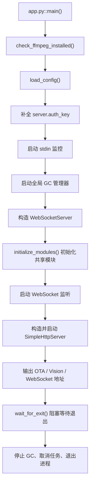

# 服务启动详细设计

本文描述 `main/xiaozhi-server` 在进程启动阶段的真实执行过程，覆盖配置加载、共享组件初始化、网络服务监听、运行期等待与关闭清理等关键环节。

## 1. 适用范围

- 入口文件：[main/xiaozhi-server/app.py](D:/repository/xiaozhi-esp32-server/main/xiaozhi-server/app.py)
- 配置加载：[main/xiaozhi-server/config/config_loader.py](D:/repository/xiaozhi-esp32-server/main/xiaozhi-server/config/config_loader.py)
- 日志初始化：[main/xiaozhi-server/config/logger.py](D:/repository/xiaozhi-esp32-server/main/xiaozhi-server/config/logger.py)
- WebSocket 服务：[main/xiaozhi-server/core/websocket_server.py](D:/repository/xiaozhi-esp32-server/main/xiaozhi-server/core/websocket_server.py)
- HTTP 服务：[main/xiaozhi-server/core/http_server.py](D:/repository/xiaozhi-esp32-server/main/xiaozhi-server/core/http_server.py)
- 共享模块初始化：[main/xiaozhi-server/core/utils/modules_initialize.py](D:/repository/xiaozhi-esp32-server/main/xiaozhi-server/core/utils/modules_initialize.py)

## 2. 启动总览

服务主入口是 `asyncio.run(main())`。启动时序可以概括为：

1. 检查运行环境依赖。
2. 加载主配置。
3. 计算认证密钥 `server.auth_key`。
4. 启动后台辅助任务。
5. 初始化共享模块并启动 WebSocket 服务。
6. 初始化 HTTP 服务并暴露 OTA / Vision 接口。
7. 输出可访问地址，进入阻塞等待。
8. 收到退出信号后执行清理。

## 3. 主入口执行过程

### 3.1 运行入口

入口位于 [app.py](D:/repository/xiaozhi-esp32-server/main/xiaozhi-server/app.py:132)：

- `__main__` 中调用 `asyncio.run(main())`
- 如果用户在控制台按下 `Ctrl+C`，最外层会捕获 `KeyboardInterrupt`

### 3.2 依赖检查

[app.py](D:/repository/xiaozhi-esp32-server/main/xiaozhi-server/app.py:47) 第一件事是执行 `check_ffmpeg_installed()`：

- 通过调用 `ffmpeg -version` 检查系统中是否存在可用的 `ffmpeg`
- 如果缺少可执行文件或动态库，会直接抛异常并终止启动

这个步骤的目的不是可选优化，而是提前失败，避免后续 TTS / 音频处理阶段才暴露环境问题。

## 4. 主配置加载过程

### 4.1 配置入口

主配置由 [config_loader.py](D:/repository/xiaozhi-esp32-server/main/xiaozhi-server/config/config_loader.py:20) 的 `load_config()` 负责加载。

该函数的执行顺序如下：

1. 先查配置缓存 `CacheType.CONFIG/main_config`
2. 读取默认配置文件 `config.yaml`
3. 读取自定义配置文件 `data/.config.yaml`
4. 根据 `data/.config.yaml` 是否配置 `manager-api.url`，决定走本地合并还是 API 拉取
5. 创建日志、模型输出等目录
6. 将最终结果写回配置缓存

### 4.2 本地配置模式

当 `data/.config.yaml` 中没有 `manager-api.url` 时：

- 使用 `merge_configs(default_config, custom_config)` 递归合并
- `custom_config` 优先级高于 `default_config`
- 最终配置完全来自本地文件

### 4.3 智控台配置模式

当 `data/.config.yaml` 中配置了 `manager-api.url` 时，会进入 [config_loader.py](D:/repository/xiaozhi-esp32-server/main/xiaozhi-server/config/config_loader.py:56) 的 `get_config_from_api_async()`：

1. 调用 `init_service(config)` 初始化 `ManageApiClient`
2. 调用 `/config/server-base` 获取服务基础配置
3. 将结果标记为 `read_config_from_api = True`
4. 将本地 `manager-api.url` 与 `manager-api.secret` 重新写回配置
5. 使用本地 `server.ip / port / http_port / vision_explain / auth_key` 覆盖接口返回的 `server` 字段
6. 保留接口返回的 `server.auth.enabled`
7. 如果接口未返回 `prompt_template`，回退到本地配置

这里有一个重要特征：

- 智控台模式下，**基础配置不是写回 `config.yaml`**
- 而是启动时通过接口拉取到内存中使用

### 4.4 配置文件校验与日志初始化耦合

[logger.py](D:/repository/xiaozhi-esp32-server/main/xiaozhi-server/config/logger.py:42) 的 `setup_logging()` 会先调用 [settings.py](D:/repository/xiaozhi-esp32-server/main/xiaozhi-server/config/settings.py:9) 的 `check_config_file()`：

- 强制要求 `data/.config.yaml` 存在
- 如果检测到当前是智控台模式，但 `data/.config.yaml` 里还保留了本地完整模块配置，会直接抛错

因此，日志系统初始化本身就隐含了一次配置文件合法性检查。

### 4.5 目录准备

[config_loader.py](D:/repository/xiaozhi-esp32-server/main/xiaozhi-server/config/config_loader.py:102) 的 `ensure_directories()` 会在启动阶段创建：

- 日志目录
- `data` 目录
- ASR/TTS 模块声明的输出目录
- 当前所选模型的输出目录

这一步的目标是把文件系统问题前置到启动阶段。

## 5. 认证密钥补全

主配置加载完后，[app.py](D:/repository/xiaozhi-esp32-server/main/xiaozhi-server/app.py:51) 会补全 `server.auth_key`。

优先级如下：

1. `config["server"]["auth_key"]`
2. `config["manager-api"]["secret"]`
3. 自动生成随机 UUID

该密钥用于：

- WebSocket JWT 鉴权
- 视觉分析接口 JWT 鉴权
- OTA 下发 token 生成

因此即使本地配置未明确指定 `auth_key`，启动阶段也一定会为服务补齐一个可用值。

## 6. 后台任务启动

### 6.1 标准输入监控任务

[app.py](D:/repository/xiaozhi-esp32-server/main/xiaozhi-server/app.py:62) 会创建 `stdin_task = asyncio.create_task(monitor_stdin())`。

作用：

- 持续消费控制台回车输入
- 避免标准输入缓冲影响交互式运行

### 6.2 全局 GC 管理器

[app.py](D:/repository/xiaozhi-esp32-server/main/xiaozhi-server/app.py:65) 会获取并启动全局 GC 管理器：

- 实现在 [gc_manager.py](D:/repository/xiaozhi-esp32-server/main/xiaozhi-server/core/utils/gc_manager.py)
- 默认每 300 秒执行一次 `gc.collect()`
- 真正的 GC 操作放在线程池中执行，避免阻塞事件循环

设计目的：

- 避免 Python 在高并发语音链路中频繁随机触发 GC
- 通过低频、可控的方式集中清理对象

## 7. WebSocket 服务初始化

### 7.1 构造阶段

[app.py](D:/repository/xiaozhi-esp32-server/main/xiaozhi-server/app.py:72) 会构造 `WebSocketServer(config)`。

在 [websocket_server.py](D:/repository/xiaozhi-esp32-server/main/xiaozhi-server/core/websocket_server.py:35) 的构造函数中，会完成以下工作：

1. 保存主配置 `self.config`
2. 创建 `config_lock`，用于运行期热更新
3. 调用 `initialize_modules()` 初始化共享组件
4. 创建 `AuthManager`
5. 记录设备白名单与认证开关

### 7.2 启动阶段初始化的共享模块

`WebSocketServer` 在构造时初始化的是“服务级共享模块”，不是“连接级独占模块”。

初始化开关由 `selected_module` 决定：

- `VAD`
- `ASR`
- `LLM`
- `Memory`
- `Intent`

TTS 在这里明确传入的是 `False`，不会在服务启动时作为共享单例初始化。

### 7.3 initialize_modules 真实行为

[modules_initialize.py](D:/repository/xiaozhi-esp32-server/main/xiaozhi-server/core/utils/modules_initialize.py:8) 的 `initialize_modules()` 会根据布尔开关逐个执行：

- `initialize_tts()`
- `llm.create_instance()`
- `intent.create_instance()`
- `memory.create_instance()`
- `vad.create_instance()`
- `initialize_asr()`

其中：

- TTS 初始化会记录 `module` 和 `type`
- ASR 初始化结束后会额外打印 `ASR模块初始化完成`
- Memory 初始化会带上 `summaryMemory`

### 7.4 启动监听

[app.py](D:/repository/xiaozhi-esp32-server/main/xiaozhi-server/app.py:73) 创建 `ws_task = asyncio.create_task(ws_server.start())`。

[websocket_server.py](D:/repository/xiaozhi-esp32-server/main/xiaozhi-server/core/websocket_server.py:61) 的 `start()` 会：

1. 读取 `server.ip`
2. 读取 `server.port`
3. 调用 `websockets.serve(...)` 开启监听
4. 通过 `await asyncio.Future()` 让任务永久挂起，维持服务运行

另外，模块导入阶段会先执行 `_setup_websockets_logger()`：

- 过滤无效握手日志
- 避免浏览器误访问 WS 端口时污染日志

## 8. HTTP 服务初始化

### 8.1 构造阶段

[app.py](D:/repository/xiaozhi-esp32-server/main/xiaozhi-server/app.py:75) 会构造 `SimpleHttpServer(config)`。

[http_server.py](D:/repository/xiaozhi-esp32-server/main/xiaozhi-server/core/http_server.py:10) 在构造时会同时创建：

- `OTAHandler(config)`
- `VisionHandler(config)`

### 8.2 启动阶段

[app.py](D:/repository/xiaozhi-esp32-server/main/xiaozhi-server/app.py:76) 创建 `ota_task = asyncio.create_task(ota_server.start())`。

[http_server.py](D:/repository/xiaozhi-esp32-server/main/xiaozhi-server/core/http_server.py:30) 的 `start()` 会：

1. 读取 `server.ip`
2. 读取 `server.http_port`
3. 创建 `aiohttp.web.Application`
4. 根据是否开启智控台模式注册不同路由
5. 通过 `AppRunner` + `TCPSite` 启动监听
6. 进入每小时 sleep 一次的无限循环维持任务存活

### 8.3 路由注册规则

如果 `read_config_from_api = False`：

- 注册简易 OTA 路由
  - `GET /xiaozhi/ota/`
  - `POST /xiaozhi/ota/`
  - `OPTIONS /xiaozhi/ota/`
  - `GET /xiaozhi/ota/download/{filename}`

无论是否开启智控台模式，都会注册：

- `GET /mcp/vision/explain`
- `POST /mcp/vision/explain`
- `OPTIONS /mcp/vision/explain`

## 9. 启动完成后的地址输出

服务任务创建完成后，[app.py](D:/repository/xiaozhi-esp32-server/main/xiaozhi-server/app.py:79) 会输出当前可访问地址：

- OTA 地址
- 视觉分析地址
- MCP 接入点地址
- WebSocket 地址

其中 MCP 接入点会先执行一次规范校验：

- 合法则输出日志，并把配置中的 `/mcp/` 自动改写成 `/call/`
- 不合法则记录错误并回退为占位文本

这一步只影响运行时内存配置，不会修改磁盘配置文件。

## 10. 运行期等待与退出

### 10.1 阻塞等待

[app.py](D:/repository/xiaozhi-esp32-server/main/xiaozhi-server/app.py:111) 调用 `await wait_for_exit()`。

处理方式区分平台：

- Unix / macOS：
  - 注册 `SIGINT` / `SIGTERM`
  - 收到信号后唤醒退出事件
- Windows：
  - 挂起一个永不完成的 `Future`
  - 依靠 `KeyboardInterrupt` 从 `asyncio.run()` 外层冒泡

### 10.2 关闭清理

退出时会进入 `finally`：

1. 停止全局 GC 管理器
2. 取消 `stdin_task`
3. 取消 `ws_task`
4. 取消 `ota_task`
5. 最多等待 3 秒让各任务结束
6. 输出“服务器已关闭，程序退出”

这说明服务关闭是协程级取消，不是显式逐个关闭 socket 监听器对象。

## 11. 服务启动后，连接建立时的补充初始化

这一部分不属于“进程启动”，但经常和启动流程混淆，因此单独说明。

### 11.1 新连接创建

每当有新的 WebSocket 连接到达，[websocket_server.py](D:/repository/xiaozhi-esp32-server/main/xiaozhi-server/core/websocket_server.py:100) 会创建新的 `ConnectionHandler`。

在 [connection.py](D:/repository/xiaozhi-esp32-server/main/xiaozhi-server/core/connection.py:74) 中：

- `self.common_config = config`
- `self.config = copy.deepcopy(config)`

这意味着：

- 服务级配置是共享基线
- 每个连接都会复制一份独立运行时配置

### 11.2 连接建立后的后台初始化

连接进入 `handle_connection()` 后，会立即创建后台任务 `self._background_initialize()`：

1. 拉取差异化配置 `get_private_config_from_api()`
2. 按需更新当前连接的 `ASR / VAD / LLM / TTS / Memory / Intent / prompt / mcp_endpoint` 等配置
3. 初始化连接级组件

这个阶段才会完成：

- 连接级 TTS 初始化
- 差异化模型装配
- 设备绑定判定
- 私有插件配置装配

因此，“服务进程启动成功”并不等于“每个连接的私有能力都已完成初始化”。

## 12. 关键设计特点

### 12.1 启动期与连接期分层

当前实现把初始化分成两层：

- 启动期：加载主配置、初始化共享组件、开放监听端口
- 连接期：拉取设备级差异化配置、初始化连接独占能力

这样做的好处是：

- 服务可以尽快进入可连接状态
- 不会因为某个设备的差异化配置请求慢而阻塞整体启动

### 12.2 智控台模式是“内存配置驱动”

智控台模式下：

- 启动时通过 `/config/server-base` 拉基础配置
- 连接时通过 `/config/agent-models` 拉差异化配置

配置主要在内存中流转，不回写 `config.yaml`。

### 12.3 共享模块与连接独占模块并存

当前架构同时存在：

- 服务级共享实例
- 连接级独立实例

这使得启动阶段和连接阶段的初始化职责被明确拆开，但也要求排查问题时区分：

- 是主配置问题
- 还是单连接差异化配置问题

## 13. 排障建议

如果项目“启动了但不可用”，建议按以下顺序排查：

1. `ffmpeg` 是否可执行
2. `data/.config.yaml` 是否存在
3. `manager-api.url / secret` 是否可用
4. 启动日志里是否打印了共享模块初始化成功
5. WebSocket 端口和 HTTP 端口是否真正监听
6. 新连接建立后，后台差异化初始化是否成功

如果项目“能启动但某些设备异常”，优先怀疑的是连接期差异化配置，而不是进程启动链路本身。
